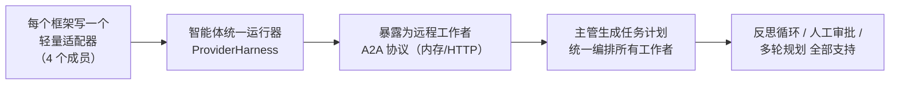

# UniversalContract：多智能体协作的统一契约参考实现

## 这是什么

一套把**不同框架写的 AI 智能体**组织起来协同工作的参考代码。

实际场景：政策智能体（MAF 写的）、风险智能体（LangGraph 写的）、客服
智能体（AgentScope 写的）需要协同完成"客户退款申请"流程。直接互相调用
会让框架对象互相依赖、无法替换。本项目的解法：



**核心保证**：智能体之间只传纯数据（任务单、回执、会话状态），不传
框架对象——所以任何一层都可以单独替换，换框架时对话和记录不丢。

## 快速开始

```bash
python -m pip install -r requirements.txt
python tests/test_offline.py     # 离线检查
```

需要真实外部服务的双 Agent 出行示例有两个版本：
`demo/react-orchestration-2-agent/` 使用内存 A2A transport 与硬编码装配；
`demo/react-orchestration-2-agent-fastapi/` 使用 YAML 选择已注册模板，并通过 FastAPI
HTTP A2A 路由调用 Worker。二者均先通过 AMap MCP 查询上海 POI 与天气、选择日期，再通过
Maqami MCP 查询同日北京到上海的单程直飞航班报价。运行前请配置以下环境变量
（也可写入本地未提交的 `.env`）：

```bash
export AMAP_MCP_ENDPOINT="https://your-amap-mcp-endpoint"
export UNIVERSAL_CONTRACT_LLM_BASE_URL="https://your-llm-gateway/v1"
export UNIVERSAL_CONTRACT_LLM_API_KEY="..."
export UNIVERSAL_CONTRACT_LLM_MODEL="gpt-4o-mini"  # 可选
python demo/react-orchestration-2-agent/demo.py
python demo/react-orchestration-2-agent-fastapi/demo.py
```

该示例使用官方 `mcp` SDK 在每次 Worker 调用中发现 AMap 的工具，并通过
OpenAI-compatible function calling 执行 `tools/call` 循环；端点和密钥均不写入源码。

完整的环境要求、虚拟环境、pip 安装、验证及常见问题见
[用户安装手册](docs/06_用户安装手册.md)。本地、独立 HTTPS Worker 与高并发异步
部署，以及企业 IAM、mTLS 和多租户边界见 [部署与认证指南](docs/07_部署与认证指南.md)。

## 可运行验证

`tests/test_offline.py` 覆盖多智能体计划、内置 REACT、Magentic REACT、工具与技能声明、
人工审批恢复与跨 runtime 会话共享，且不需要模型 API Key。外部服务场景使用
`demo/react-orchestration-2-agent/demo.py` 与
`demo/react-orchestration-2-agent-fastapi/demo.py`。

## 目录

```
├── common/                   # 共享中立层：契约、协作快照与 A2A 边界适配
│   ├── contracts.py          # 全部数据类型与接口（纯定义，零逻辑）
│   ├── collaboration.py      # 事实、任务输入与前序回执的协作快照
│   ├── a2a.py                # A2A 协议两端与内存/HTTP 传输实现
│   └── providers.py          # 可复用的内存会话与静态上下文 Provider（demo/测试）
│   └── security.py           # 中立认证、授权与 tenant 作用域接口
├── deployment/               # FastAPI A2A 服务、安全边界与健康探针
├── harness/                  # Harness 生命周期 + AgentScope/OpenAI/MCP runtime adapter
├── orchestration/            # 工作流编排 + Magentic 框架引擎
├── demo/                     # 需要真实 LLM 与 MCP 服务的端到端示例
│   ├── react-orchestration-2-agent/ # 内存 A2A：AMap 天气/POI + Maqami 航班报价
│   └── react-orchestration-2-agent-fastapi/ # YAML 配置 + FastAPI HTTP A2A
├── tests/test_offline.py     # 41 项离线检查
└── docs/
    ├── 01_架构设计.md          # 分层架构 / 三角色 / 数据流 / 设计原则
    ├── 02_类设计与交互.md      # 类图 / 接口与实现对应 / 交互总图
    ├── 03_典型场景时序图.md    # 六个场景的时序图
    └── 04_框架适配指南.md      # 接入新框架的完整对照表与验收清单
    └── 05_协作状态共享.md      # 跨 mode、跨 runtime 的协作状态协议
    └── 06_用户安装手册.md       # pip 安装、验证、运行示例与常见问题
    └── 07_部署与认证指南.md     # 本地/云端部署、IAM 与多租户隔离
```

## 最小使用示例

```python
import os

from common.contracts import HarnessSpec, AgentIdentity, LlmServingSpec, McpServerSpec, McpTransport, SkillSpec
from harness import ProviderHarness
from harness.openai_compatible import OpenAICompatibleRuntimeAdapter
from common.a2a import A2AWorkerEndpoint, A2AWorkerService, InMemoryA2ATransport
from orchestration import create_workflow

# 1. 声明一个智能体（静态配置：身份 + 指令 + 工具 + 技能）
spec = HarnessSpec(
    identity=AgentIdentity("policy-worker", "政策 Worker"),
    instructions="只解释退款政策。",
    tools=[McpServerSpec(name="refund-tools", transport=McpTransport.STREAMABLE_HTTP,
                         url="http://mcp.internal/refund")],
    skills=[SkillSpec(name="refund-policy", source="inline", content="# ...")],
    llm_serving=LlmServingSpec(
        model="policy-model",
        base_url="https://llm-gateway.example/v1",
        api_key=os.environ["POLICY_WORKER_API_KEY"],
    ),
)

# 2. 跑起来（第三个参数是框架适配器：MAF/AgentScope/LangGraph/OpenAI 各写一个）
harness = ProviderHarness(spec, providers, OpenAICompatibleRuntimeAdapter())
problems = await harness.validate()        # 启动前校验（空 = 通过）

# 3. 暴露为远程工作者（demo 用内存传输；生产换 HTTP）
service = A2AWorkerService(harness, "policy-worker")
endpoint = A2AWorkerEndpoint(WorkerDescriptor("policy-worker", "memory://policy",
                                              frozenset({"refund-policy"})),
                             InMemoryA2ATransport({"memory://policy": service}))

# 4. 编排多个工作者：唯一推荐入口由 orchestration_request.mode 选择工作流
workflow = create_workflow(orchestration_request, [endpoint, other_endpoint], leader=my_leader)
events = await workflow.run(orchestration_request)
result = list(events.get_outputs())[-1]    # OrchestrationResult（非 REACT 模式）
```

每个 `HarnessSpec.llm_serving` 都可以设置不同的 `base_url`、`api_key` 和
`model`，所以同一工作流中的 Worker 可连接不同供应商或模型网关。编排层也可
独立配置 Serving：`create_workflow(request, workers, llm_serving=planner_serving)`
会在未传入 `leader` 时创建 `OpenAICompatibleLeader`；对
`REACT + react_engine="builtin"` 还会创建同一 Serving 的 Reflector。生产中建议
从环境变量或 secret manager 注入 `api_key`，不要把密钥提交进代码或写进请求/会话。

## 接入新框架

AgentScope 可直接使用框架提供的 `AgentScopeRuntimeAdapter`；编排层优先使用
`create_workflow(request, workers, ...)`，由 `request.mode` 唯一选择 REACT 或
单轮执行图，并校验 Leader 产出的计划 mode 与请求声明一致。其他 runtime
只需要实现一个适配器类（4 个成员：`runtime_name` / `capabilities()` /
`build()` / `close()`），把 contracts 里的中立声明翻译成框架原生构造。
完整的六框架对照表、特性保留矩阵和验收清单见 **docs/04_框架适配指南.md**。

## 多智能体共享信息

编排层在每次调用 Worker 前创建中立 `collaboration` 快照，其中包含工作流事实、
当前任务输入、已完成回执及显式依赖回执；它经 A2A 保存在
`AgentRequest.metadata["collaboration"]`。`ProviderHarness` 会自动把它及持久会话转换为
保留的 `contract.*` `ContextItem`，因此 MAF 内置图、Magentic participant 与任意合规
Harness runtime 看见的是同一份数据格式；runtime adapter 只需将完整 `context_items` 注入
自己的原生 runtime。`CONCURRENT` 只共享启动时事实，
有序模式与 REACT 还能消费前序回执。

`SharedSession` 是另一条长期记忆线。所有 Worker 复用同一 `SessionProvider` 和
`session_id` 时，切换单个 Agent runtime 后仍能恢复业务事实与对话记录。协作字段、
并发限制及 adapter 接入规则见 [docs/05_协作状态共享.md](docs/05_协作状态共享.md)。

## 术语速查

| 术语 | 含义 |
|---|---|
| 契约（contracts） | 各层共同依赖的数据类型与接口定义 |
| 主管（Leader） | 把业务目标翻译成任务计划的策略（可以是规则或 LLM） |
| 工作者（Worker） | 被编排的智能体，通过统一端点接受任务单 |
| 任务单（WorkerTask） | 一次工作单元的指令（含幂等键、依赖、恢复载荷） |
| 运行器（ProviderHarness） | 包裹单个智能体的执行外壳（会话/上下文/记账） |
| 框架适配器（RuntimeAdapter） | 把中立声明翻译成某个框架原生构造的胶水层 |
| 反思循环（REACT） | 执行一轮 → 观察结果 → 决定追加任务或结束的迭代模式 |
| 共享会话（SharedSession） | 跨智能体、跨框架的业务连续性载体（只存中立数据） |
| 幂等键（idempotency_key） | 防止远程副作用重复执行的凭证（恢复时必须复用） |
