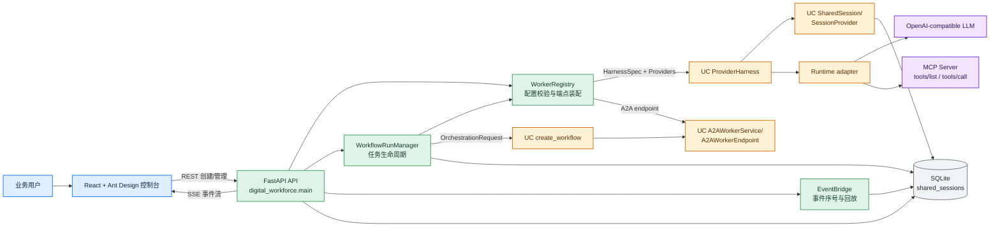
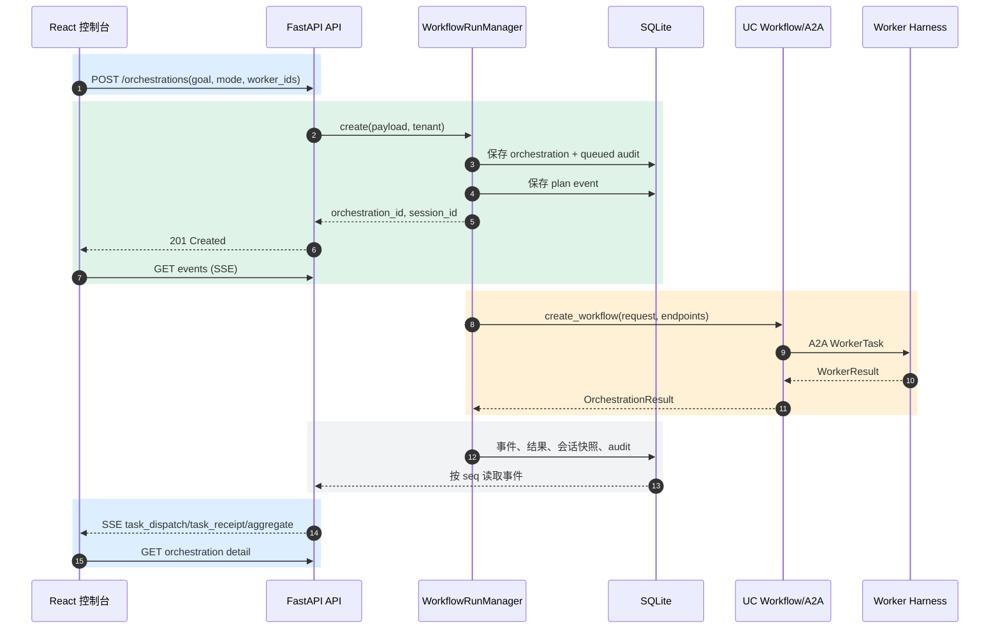
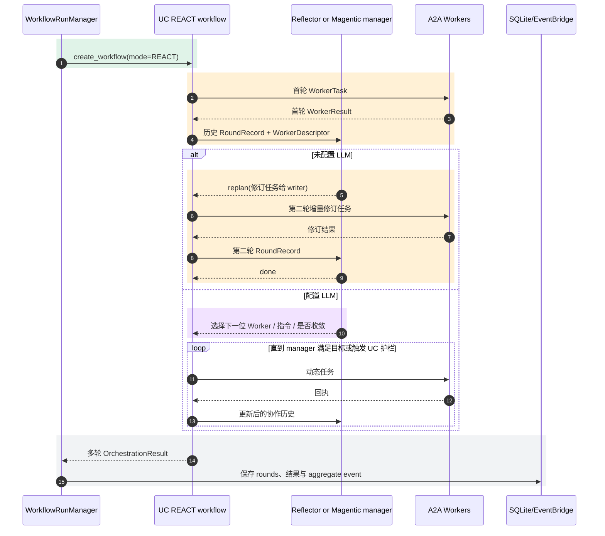
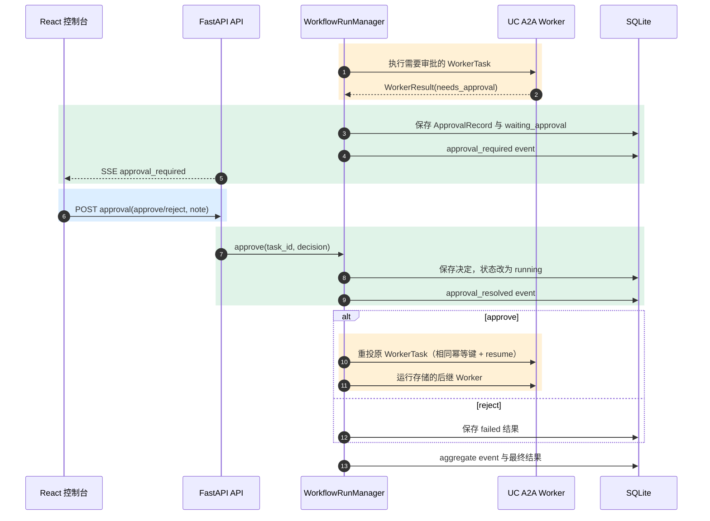
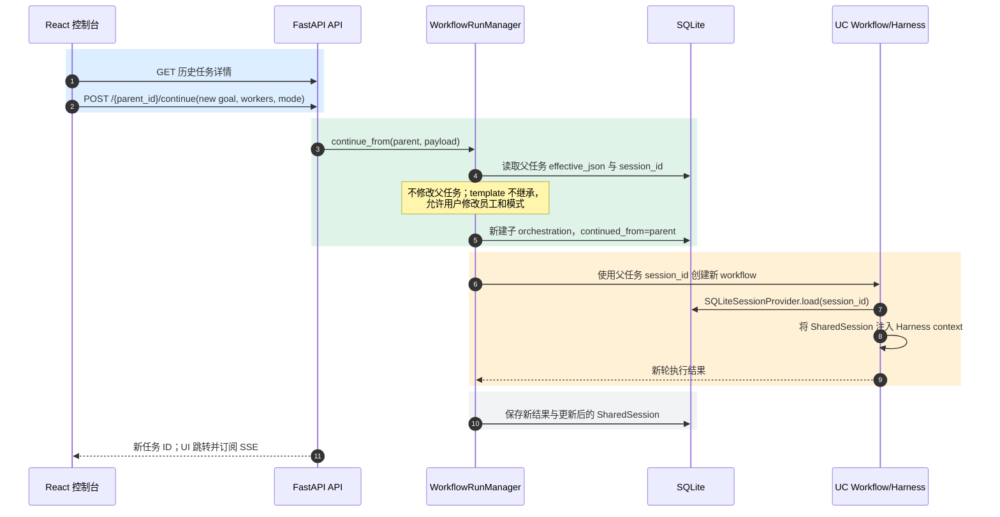

# Digital Workforce Platform 架构设计

本文说明 `digital-workforce-platform` 如何把 Web 控制台、平台服务与 UniversalContract（UC）组合为一个可运行的数字员工协作系统。设计目标是：平台负责管理、持久化、审计与用户体验；UC 负责跨 runtime 的智能体契约、会话、A2A 调用及编排语义。

## 1. 设计边界

平台不是另一套 Agent 框架。它将用户配置翻译为 UC 的中立数据类型，并始终通过 UC 的公开抽象运行 Worker：

| 平台负责 | UniversalContract 负责 |
|---|---|
| React 控制台、REST API、SSE、任务/审批/审计数据模型 | `HarnessSpec`、`HarnessProviders`、`ProviderHarness` 生命周期 |
| Worker、Skill、MCP Server 的租户级管理与兼容性校验 | `SharedSession`、`SessionProvider`、标准上下文注入 |
| 创建工作流、状态转换、历史任务续办 | `WorkerTask`、`WorkerResult`、`OrchestrationRequest`、`create_workflow()` |
| SQLite 存储和 CSV 导出 | A2A `WorkerEndpoint` / `A2AWorkerService` 协议边界 |
| UI 选择 runtime、MCP 与协作模式 | OpenAI-compatible、AgentScope、LangGraph、MCP 等 runtime adapter |

这个分层意味着平台不读取或保存 AgentScope、LangGraph 等框架私有对象。数据库中保存的是 UC 中立任务、结果、会话和配置；更换单个 Worker runtime 不会破坏任务协议或共享会话。

## 2. 总体架构

颜色含义：蓝色为浏览器层，绿色为平台 API/编排层，橙色为 UC 抽象与运行层，紫色为外部模型与 MCP，灰色为持久化层。

独立源文件：[architecture/01-overview.mmd](architecture/01-overview.mmd)。

## 3. 前端与 API 架构

前端是单页 React 应用，`api.ts` 是唯一 HTTP 边界。页面按工作流分为：员工目录与注册、Skill 管理、MCP 管理、发起任务、执行详情、任务历史与续办。

| 前端能力 | API | 后端职责 |
|---|---|---|
| 员工与 runtime/MCP 绑定 | `/api/workers` | `WorkerRegistry` 验证 runtime、能力和 MCP 组合，保存动态 Worker |
| Skill 与 MCP 目录 | `/api/skills`、`/api/mcp-servers` | 解析 Skill、保存端点/白名单；MCP 可执行 `initialize + tools/list` 探测 |
| 创建和查询任务 | `/api/orchestrations` | `WorkflowRunManager` 创建不可变任务记录，后台运行 UC workflow |
| 实时轨迹 | `/api/orchestrations/{id}/events` | `EventBridge` 从 SQLite 事件记录按序 SSE 回放，支持 `Last-Event-ID` |
| 审批与恢复 | `/approvals/{task_id}` | 保存审批决定，重新投递原任务并只运行后继任务 |
| 历史续办 | `/{id}/continue` | 创建新的子任务，复用原 `session_id`，允许改变目标、模式和员工 |

任务详情页先读取任务快照，再连接 SSE。收到 `plan`、`task_dispatch`、`task_receipt`、`approval_required`、`aggregate` 或 `failed` 后重新读取任务详情。因此浏览器断线不会丢失事件：事件先写 SQLite，再由 SSE 按序重放。

## 4. 平台如何使用 UC 抽象

### 4.1 Worker 配置到 UC Harness

`WorkerRegistry` 将数据库记录或内置预设转换为 `WorkerPreset`，再据此构造：

1. `HarnessSpec`：`AgentIdentity`、职责指令、`Capability`、Skill、MCP `McpServerSpec` 与可选 `LlmServingSpec`。
2. `HarnessProviders`：所有同租户 Worker 共享的 `SQLiteSessionProvider`，以及按 Worker Skill 构建的 `SkillRegistry`。
3. `ProviderHarness`：将请求生命周期统一为加载会话、生成标准 `ContextItem`、调用 runtime、追加结果并保存会话。
4. `A2AWorkerService` 与 `A2AWorkerEndpoint`：即使 demo 内使用 `InMemoryA2ATransport`，编排器看到的仍是标准远程 Worker 边界，而不是 runtime 对象。

runtime 不由前端任意指定。注册表校验下列约束后才允许保存：

| runtime | MCP 约束 |
|---|---|
| `offline-contract` | 不允许 MCP；用于无模型的流程演示 |
| `openai-compatible` | 不允许 MCP |
| `mcp-openai-compatible` | 恰好一个 `streamable_http` MCP |
| `agentscope-mcp` / `langgraph-mcp` | 至少一个 `streamable_http` MCP |

### 4.2 任务、协作快照与编排

`WorkflowRunManager` 为每次请求创建 UC `OrchestrationRequest(workflow_id, session_id, goal, facts, mode)`，随后调用 `create_workflow()`。

- 顺序、并行和接力模式：`DeterministicLeader` 生成 `OrchestrationPlan` 与 `WorkerTask`；UC 调度器按 `depends_on` 或并行语义执行。
- REACT 且没有模型：UC builtin 反思图运行首轮协作，`DeterministicReflector` 生成一项增量修订任务，第二轮完成后收敛。
- REACT 且配置模型：平台创建 UC Magentic manager agent，Magentic 根据 WorkerDescriptor、历史发言和回执决定下一位 Worker 及是否继续。

每个任务都具有稳定的 `task_id` 和 `idempotency_key`。平台的 `EventedWorkerEndpoint` 包装 UC endpoint，在不改变协议的情况下记录 `task_dispatch` 和 `task_receipt` 事件。

### 4.3 会话与持久化

`SQLiteSessionProvider` 结构化实现 UC `SessionProvider` 协议：

- 键为 `(tenant_id, session_id)`；不同租户不会读取彼此的 `SharedSession`。
- 值为中立 JSON：`facts`、`messages` 与 `runtime_references`，不保存框架对象。
- 同一 session 的保存操作受 `asyncio.Lock` 保护，避免并发 Worker 首次插入时竞争。

任务记录和会话是两条不同的持久化线：

| 数据 | 主要表 | 用途 |
|---|---|---|
| 任务快照 | `orchestrations` | 目标、模式、有效配置、状态、结果、会话快照 |
| 执行审计 | `audit_records`、`orchestration_events` | 排队、结果、审批恢复和可回放实时事件 |
| 中断恢复 | `approvals` | 原任务、幂等键、审批状态与决定 |
| 长期上下文 | `shared_sessions` | UC `SharedSession` 的跨任务连续性 |
| 管理配置 | `workers`、`skills`、`mcp_servers` | 租户级可配置资源 |

## 5. 常见场景时序

以下时序图均启用 `autonumber`。图中蓝色区域是浏览器交互，绿色区域是平台控制面，橙色区域是 UC 执行面，灰色区域是 SQLite，紫色区域表示可选外部模型或工具。

### 5.1 创建普通协作任务并观察实时结果

独立源文件：[architecture/02-task-execution-sequence.mmd](architecture/02-task-execution-sequence.mmd)。

### 5.2 REACT 反思循环

独立源文件：[architecture/03-react-sequence.mmd](architecture/03-react-sequence.mmd)。

### 5.3 接力审批与恢复

独立源文件：[architecture/04-approval-resume-sequence.mmd](architecture/04-approval-resume-sequence.mmd)。

### 5.4 从历史任务续办

独立源文件：[architecture/05-continuation-sequence.mmd](architecture/05-continuation-sequence.mmd)。

## 6. 运行形态与限制

### 本地与服务器 IP 访问

前端 API 采用相对路径 `/api`，不包含 `127.0.0.1`、服务器 IP 或域名。浏览器会自动以当前
访问页面的协议、主机和端口为 API 来源：访问 `http://127.0.0.1:5173` 时请求发往同源
`/api`，访问 `http://<服务器IP>:5173` 时也请求相同服务器 IP 下的 `/api`。

开发模式下，Vite 监听 `0.0.0.0`，并将 `/api` 代理到运行同一主机上的
`127.0.0.1:8000`；Uvicorn 也应以 `--host 0.0.0.0` 启动以接收网络请求。容器模式下，Nginx
将 `/api` 转发到 Docker 网络内的 `backend:8000`。两种模式都让浏览器只面对同源前端地址，
不需要因 IP 改变修改前端构建产物或启用额外 CORS。

直接将前端与 API 分别部署到不同域名、IP 或端口时，才需要显式配置前端 API 基地址和后端
`CORS_ALLOW_ORIGINS` 白名单；该 demo 默认的 Vite/Nginx 反向代理部署不需要这样做。

### 离线演示

未配置 `UNIVERSAL_CONTRACT_LLM_API_KEY` 时，内置 Worker 使用 `OfflineRuntime`。编排、SSE、审批、SQLite 会话和 REACT 两轮修订仍能被验证；Worker 会明确返回未配置模型，而不会伪造业务答案。

### 连接真实模型与 MCP

配置 LLM 后，OpenAI-compatible runtime 会调用模型；MCP runtime 还会按绑定的 `McpServerSpec` 建立 Streamable HTTP 连接。注册与探测阶段会校验 transport、`allowed_tools` 与 runtime 组合，但生产环境仍需要满足网络连通性、凭据和实际工具授权。

### demo 的部署边界

当前示例使用 SQLite、内存 A2A transport 与进程内后台任务，适用于本地演示和架构参考。多实例生产部署需将任务队列、事件分发、A2A 服务发现、密钥管理和数据库迁移替换为共享基础设施，同时保持 UC 的中立契约边界不变。