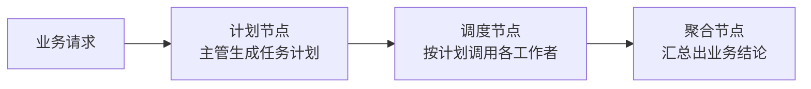
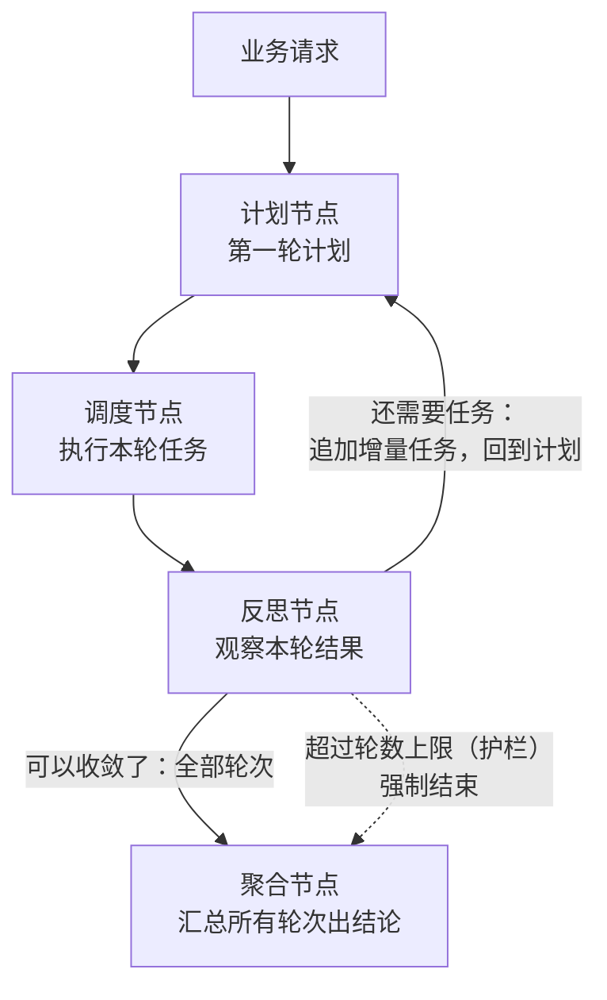
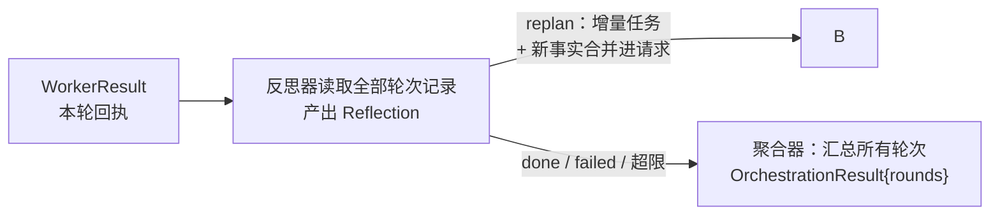

# 整体架构设计

> 本文档回答三个问题：这套代码是干什么的？分几层、每层管什么？
> 一次调用从头到尾是怎么流动的？
>
> 阅读对象：第一次接触本项目的工程师。全文使用通用术语，配图优先。

---

## 1. 这套代码是干什么的

一句话：**把"一个智能体（Agent）"用统一的接口跑起来，再把它变成可以被
远程调用的"工作者（Worker）"，最后由一个多智能体工作流（主管分派任务）
来编排多个工作者协作。**

它解决的实际问题：公司里有多个团队，分别用 MAF、AgentScope、LangGraph、
OpenAI SDK 写了各自的智能体。这些智能体需要协同完成一个业务流程（比如
"客户申请退款 → 政策核查 → 风险核查 → 人工审批"）。直接互相调用会导致
框架对象互相依赖、无法替换、无法审计。

本项目的做法是约定一套位于 `common/` 的**框架无关数据契约**（`common/contracts.py`）：
- 所有模块之间只传递**纯数据**（任务单、结果回执、会话状态），
- 每个框架写一个**适配器**把契约翻译成自己的原生写法，
- 任何一层都可以单独替换，其他层不用改。

`common/providers.py` 还提供可复用的中立 Provider：`InMemorySessionProvider`
用于 demo/测试的进程内会话存储，`StaticContextProvider` 用于注入静态业务策略文本。
生产环境可按 `SessionProvider`、`ContextProvider` 契约替换它们。

`auth-deploy` 分支还增加了 `common/security.py` 与 `deployment/`：认证和授权在 HTTP
A2A 服务边界执行，认证后的 tenant 用于会话存储隔离，而原始 token、证书与 IAM claims
不会进入任务、会话或框架适配器。部署细节见 [部署与认证指南](07_部署与认证指南.md)。

## 2. 分层架构

```mermaid
flowchart TB
    subgraph 编排层["编排层 orchestration/（决定谁在什么时候做什么）"]
        PE["计划节点<br/>调主管生成任务计划"] --> DE["调度节点<br/>按计划调用各工作者"] --> AE["聚合节点<br/>汇总结果出业务结论"]
    end

    subgraph 契约层["共享中立层 common/contracts.py（所有层共同依赖的纯数据定义）"]
        TYPES["任务单 WorkerTask / 回执 WorkerResult<br/>会话 SharedSession / 工具声明 McpServerSpec / 技能声明 SkillSpec<br/>接口：主管 LeaderPolicy · 工作端点 WorkerEndpoint · 传输 A2ATransport"]
    end

    subgraph 协议层["共享中立层 common/a2a.py（把本地能力变成可远程调用的服务）"]
        CLIENT["工作者客户端<br/>A2AWorkerEndpoint"] -->|"载荷（字典）"| TRANS["传输 A2ATransport<br/>demo：内存 / 生产：HTTP"] -->|"载荷（字典）"| SERVER["工作者服务端<br/>A2AWorkerService"]
    end

    subgraph Provider实现["共享中立实现 common/providers.py / common/skills.py（可替换的本地 Provider）"]
        SP["InMemorySessionProvider<br/>demo / 测试"]
        CP["StaticContextProvider<br/>静态业务策略"]
        SK["SkillRegistry<br/>目录 / 正文 / 来源冲突检测"]
    end

    subgraph 运行层["单智能体运行层 harness/ + 各框架适配器"]
        PH["运行器 ProviderHarness<br/>恢复会话→注入上下文→执行→记录→保存"] --> RT["框架适配器 HarnessRuntimeAdapter<br/>每个框架实现一个"] --> RA["智能体<br/>MAF / AgentScope / LangGraph / OpenAI SDK"]
    end

    PE -.只依赖契约.-> TYPES
    CLIENT -.只依赖契约.-> TYPES
    PH -.只依赖契约.-> TYPES
    SP -.实现.-> TYPES
    CP -.实现.-> TYPES
    SERVER -->|"调用本地运行器"| PH
```

**依赖方向的铁律：所有箭头都指向契约层，任何两层之间不直接依赖。**
契约层里没有任何框架 import——这就是"换框架不改上层"的技术保证。

## 3. 两种编排模式

编排层支持两种协作方式，共用同一批 Worker 与同一套契约：

### 3.1 模式 A：单轮计划编排（主管分派 → 执行 → 汇总）

适合"任务在开工前就能定全"的流程。

### 3.2 模式 B：反思循环（ReAct——边执行边调整）

适合"走一步看一步"的流程：第一轮只能定部分任务，后面的任务要根据
前面的结果决定。图上多一个**反思节点**和一条**回到计划节点的回边**：

反思循环有两种实现引擎，切换只需要换一个参数（`engine=`）：

| 引擎 | 谁来决定"下一个做什么" | 适合 |
|---|---|---|
| `engine="magentic"`（默认） | MAF 框架自带的 **Magentic 编排器**：管理者（manager，通常由 LLM 驱动）每轮产出"进度账本"——完成了吗/打转吗/下一个谁发言/给他什么指令 | 需要模型智能做规划的开放场景 |
| `engine="builtin"` | 本项目内置的确定性循环图：反思规则写死在代码里 | 规则明确、需要可预测行为的受控场景 |

两种引擎的调用方接口完全一致（`create_react_workflow(engine=...)`），
Worker 与会话数据面零改动。类级细节见 docs/02 第 5 节。

## 4. 四个角色

| 角色 | 是谁 | 职责 | 明确不管什么 |
|---|---|---|---|
| **主管**（Leader） | `LeaderPolicy` 接口的实现（可以是规则代码，也可以是 LLM） | 把业务目标翻译成第一轮任务计划：派哪些任务、给谁、依赖关系 | 不执行任务、不碰网络 |
| **反思器**（Reflector） | `ReflectionPolicy` 实现，或 Magentic 引擎里的管理者（manager） | 每轮结束后观察结果，决定追加任务、结束还是放弃 | 不直接执行任务；其提案受确定性护栏约束 |
| **工作者**（Worker） | `WorkerEndpoint` 接口的实现 + 远端的 `A2AWorkerService` + `ProviderHarness` | 执行一个单智能体能力，返回回执 | 不管其他 Worker、不管工作流状态 |
| **传输**（Transport） | `A2ATransport` 接口的实现（demo 是内存字典，生产是 HTTP） | 把载荷送到远端并拿回响应 | 不管业务语义 |

两句口诀：**主管管计划，反思管调整，传输管网络，工人管干活。**
（单轮模式只用得到主管与工人；反思循环模式四者齐上。）

## 5. 一次调用的完整数据流

```mermaid
flowchart LR
    A["业务请求<br/>OrchestrationRequest"] --> B["主管生成计划<br/>OrchestrationPlan（任务单列表）"]
    B --> C["调度器逐个/并行调用<br/>WorkerTask"]
    C --> D["构造 collaboration 快照<br/>事实 / 任务输入 / 前序回执"]
    D --> E["A2A 客户端打包载荷<br/>task_id / instruction / 幂等键 / 快照"]
    E --> F["传输层送达远端"]
    F --> G["A2A 服务端翻译成<br/>AgentRequest.metadata.collaboration"]
    G --> H["运行器：恢复会话<br/>注入上下文"]
    H --> I["框架智能体执行<br/>（MAF/AgentScope/...）"]
    I --> J["AgentResult"]
    J --> K["运行器记录到会话<br/>消息 / 运行ID"]
    J --> L["服务端翻译成载荷返回"]
    L --> N["客户端归一化为<br/>WorkerResult"]
    N --> M["聚合器判定业务终态<br/>OrchestrationResult"]
```

每一格箭头都是"纯数据传递"——这就是跨框架协作能成立的原因。

**模式 B（反思循环）的数据流在 K→L 之后多一段循环**：

## 6. 四个设计原则

### 6.1 契约先行：只传数据，不传对象

任何两层之间只传 `common/contracts.py` 里定义的纯数据类。框架的 agent 对象、
图的节点、HTTP 客户端，永远只出现在自己那一层的实现文件里。
**收益**：替换任何一层（换框架、换传输、换主管策略），其他层零改动。

### 6.2 协议两端分离：Service 与 Endpoint 是同一份协议的两端

`A2AWorkerService`（服务端）和 `A2AWorkerEndpoint`（客户端）维护同一份
字段名。Worker 从本进程迁到远程 HTTP 服务时，编排器和主管一行不改。

### 6.3 状态分三份，各归其主

| 状态 | 谁拥有 | 能否跨框架迁移 |
|---|---|---|
| 工作流检查点（跑到哪一步了） | 编排层（MAF Workflow 的 checkpoint） | 否，绑定工作流定义 |
| 框架私有状态（agent 内部记忆） | 各 Worker 的框架自己 | 否，绑定框架实现 |
| 共享会话（SharedSession：事实/对话/运行记录） | `SessionProvider` 存储 | **能**——全部是中立数据 |

共享会话是多智能体协作的长期"业务连续性"载体：两个 Worker 使用同一个
session_id 与 `SessionProvider` 时可恢复同一份中立记忆。任务间即时结果则由
编排层生成的 `collaboration` 快照传递，不依赖竞争读写会话。切换框架时，新
框架从同一个存储恢复会话——**对话不断**。完整规则见 docs/05。

### 6.4 幂等与恢复：超时 ≠ 没执行

每张任务单都带 `task_id` + `idempotency_key`（必填）。远端超时只说明
调用方没收到响应，不代表对方没执行。恢复的规矩：
1. 先按幂等键查询远端状态；
2. 已完成 → 取回原结果；
3. 仍执行中 → 继续等待或取消；
4. 确认未执行 → 才重新投递。
人工审批后的恢复（resume）必须**复用原任务的幂等键**（同一件事，防止重复退款）。

## 7. 目录导览

| 文件 | 一句话 |
|---|---|
| `common/contracts.py` | 全部数据类型与接口（纯定义，零逻辑） |
| `harness/provider.py` | 单智能体运行器（会话/上下文/记账） |
| `common/a2a.py` | 协议两端 + 传输（内存与 HTTP 实现） |
| `orchestration/workflow.py` | 编排节点（计划/调度/反思/聚合）+ 反思循环统一入口 |
| `orchestration/magentic.py` | 反思循环的 Magentic 引擎实现 |
| `common/collaboration.py` | 协作快照协议：事实、任务输入与前序回执的中立封装 |
| `common/skills.py` | Skill 文档、来源 Provider、注册表、前置解析与内容摘要 |
| `demo/react-orchestration-2-agent/demo.py` | 硬编码装配、内存 A2A 的 AMap 天气/POI 与 Maqami 航班报价示例 |
| `demo/react-orchestration-2-agent-fastapi/` | YAML 选择已知模板、FastAPI HTTP A2A 的同一出行 use case |
| `demo/skill-context/` | 不依赖模型的 L1 目录与 L2 Skill 正文降级注入示例 |
| `demo/rest-a2a-worker/` | 认证、scope 授权与 tenant session 隔离的离线 REST A2A 示例 |
| `tests/test_offline.py` | 离线检查（含跨 mode 共享状态回归） |
| `docs/` | 本套文档 |
