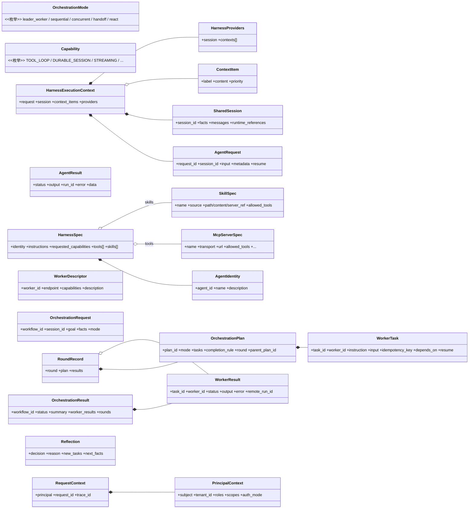
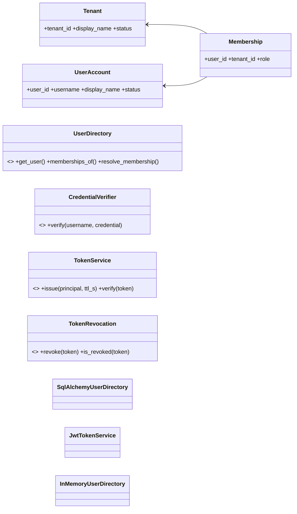
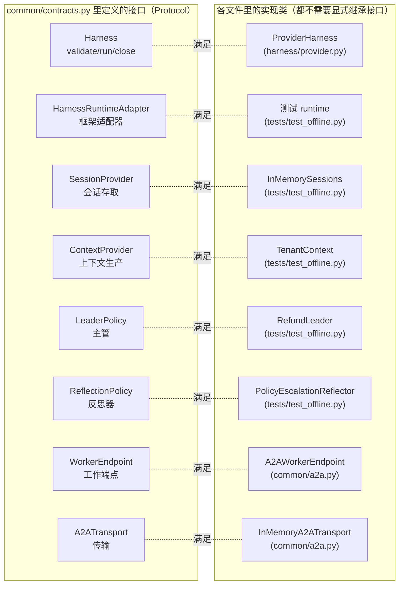
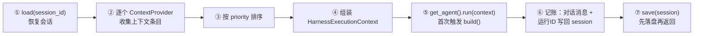
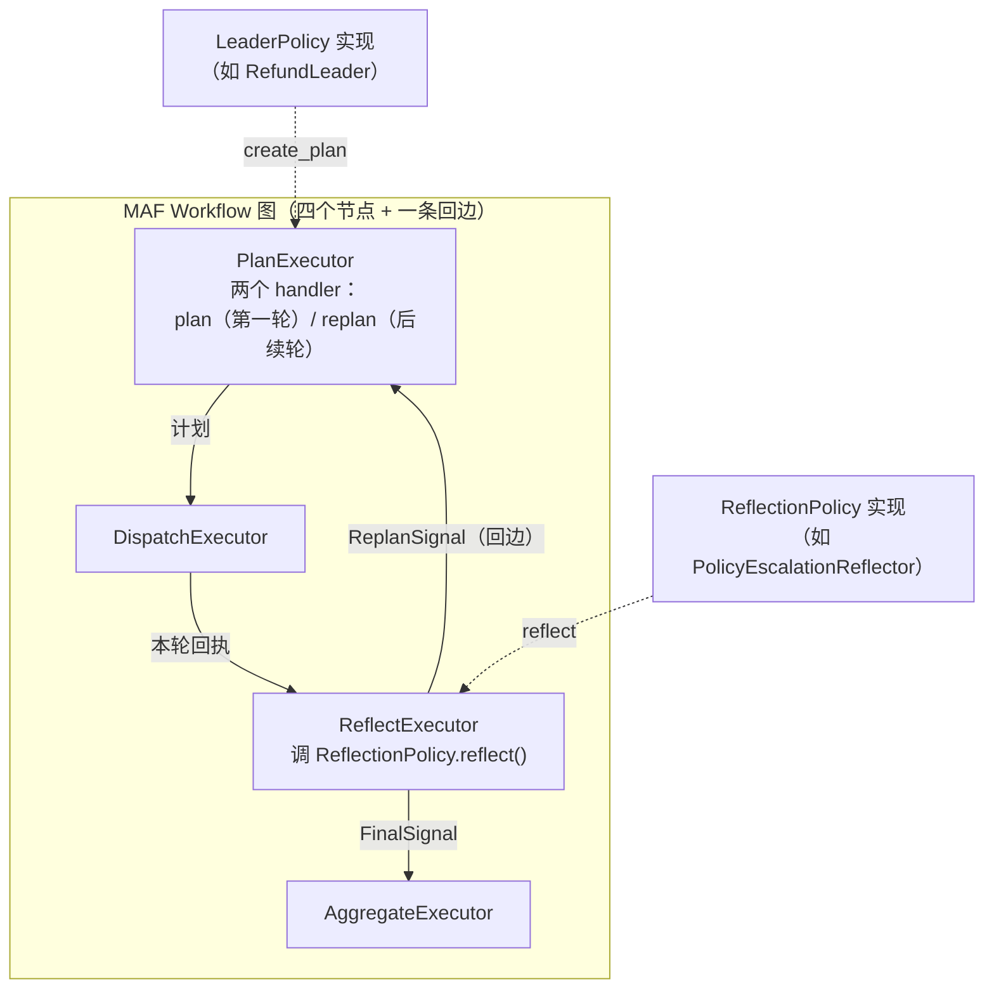
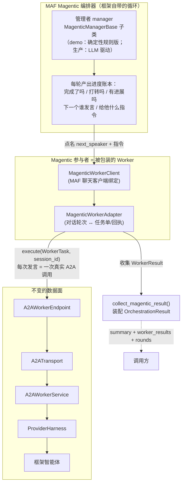
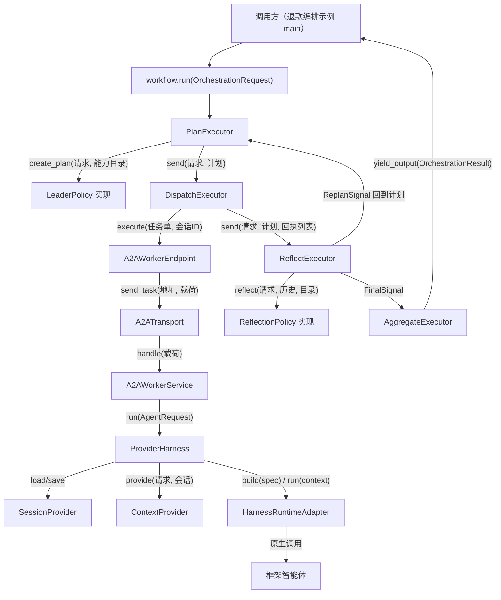
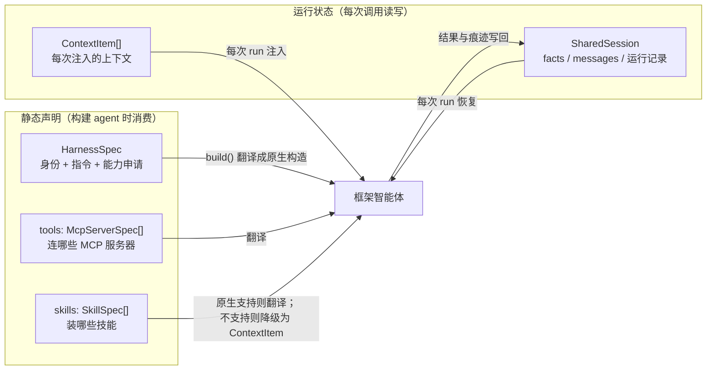

# 类设计与相互交互

> 本文档回答两个问题：有哪些类、每个类管什么？它们之间怎么调用、数据
> 怎么流动？图优先，先看类图再看交互图。

---

## 1. 契约层的类图（common/contracts.py）

## 1.1 身份与租户契约（common/identity.py、common/security.py）

身份事实与 HTTP 技术实现分开。`common/` 中只含 frozen dataclass、Protocol 和异常；
Argon2、PyJWT、SQLAlchemy、FastAPI 都只存在于平台或部署实现中。

`PrincipalContext` 只保存 user ID、当前 tenant、角色、scope 与认证方式；它不保存
password、JWT 原文或厂商 claims。平台的 `JwtTokenService` 是 HS256 参考实现，
`TokenService` 可替换为 OIDC 或 opaque-token 实现而不修改 Harness/编排层。

## 2. 接口（Protocol）与实现类的对应关系

> **为什么实现类不写 `class ProviderHarness(Harness)`？** Python 的
> Protocol 是结构化子类型：只要方法签名匹配，就自动"算是"实现了接口。
> 好处是框架适配器不需要 import 契约文件也能接入——耦合更低。

## 3. 核心类逐一说明

### 3.1 运行层（harness/ + 框架适配器）

| 类 | 职责 | 关键方法/字段 |
|---|---|---|
| `ProviderHarness` | 运行器外壳：恢复会话→收集上下文→调 agent→记账→保存 | `validate()` 启动前校验；`run(request)` 完整执行 |
| `HarnessRuntimeAdapter`（接口） | 框架适配器：把中立声明翻译成框架原生 agent | `build(spec)` 构建；`close()` 释放 |
| `RunningAgent`（接口） | 跑起来的 agent | `run(context)`；`run_stream(context)` |
| `HarnessExecutionContext` | 适配器能看到的全部输入 | request + session + context_items + providers |

**`ProviderHarness.run()` 的七步**（这是全项目被调用最多的方法）：

### 3.2 共享协议层（common/a2a.py）

| 类 | 端 | 职责 |
|---|---|---|
| `A2AWorkerService` | 服务端 | 载荷字典 → `AgentRequest` → 调 Harness → 结果 → 载荷字典 |
| `A2AWorkerEndpoint` | 客户端 | 任务单 → 校验归属 → 载荷 → 传输 → 响应 → `WorkerResult` |
| `InMemoryA2ATransport` | 传输 | 字典模拟"地址→服务"解析；生产换 HTTP 实现 |

### 3.3 编排层（orchestration/workflow.py + orchestration/magentic.py）

| 类 | 角色 | 职责 |
|---|---|---|
| `PlanExecutor` | 工作流节点 | 调主管生成计划（只递能力目录，不递端点对象） |
| `DispatchExecutor` | 工作流节点 | 并行（gather）或按序（检查 depends_on）调度任务 |
| `ReflectExecutor` | 工作流节点 | 收集每轮记录 → 调反思器 → 按护栏决定继续/结束 |
| `AggregateExecutor` | 工作流节点 | 汇总回执判业务终态（审批 > 失败 > 完成） |
| `ReplanSignal` / `FinalSignal` | 图内消息 | 反思节点发往计划节点 / 聚合节点的信号 |
| `ReactOrchestration` | 运行句柄 | 统一两种引擎的 reset() 与 finalize() |
| `MagenticWorkerAdapter` | Magentic 适配 | 对话轮次 ↔ 任务单/回执 的翻译（不依赖 MAF） |
| `MagenticWorkerClient` | MAF 绑定 | MAF 聊天客户端：指令进 → A2A 回执文本出 |
| `DeterministicMagenticManager` | 管理者 | 无需 LLM 的确定性管理者（demo/测试用；生产可换 LLM 版） |
| `collect_magentic_result()` | 结果回填 | 把 Magentic 终局发言 + 各 Worker 回执装配为 OrchestrationResult |

## 4. 反思循环的两种引擎：类交互对照

编排层支持两种模式：**单轮计划编排**（场景见 docs/03 场景 1）与**反思
循环**（ReAct，场景见 docs/03 场景 2/3）。反思循环又有两种实现引擎，
对调用方是同一个接口（`create_react_workflow(engine=)`），对 Worker 是
同一份契约——差别只在"谁来当反思决策的大脑"。

### 引擎一：builtin（内置确定性引擎）——决策在反思节点

决策逻辑 = 自己编写的 `ReflectionPolicy`（规则或 LLM 皆可）；
护栏（轮数上限/空任务/单轮预算）写死在 `ReflectExecutor` 里。

### 引擎二：magentic（默认）——决策在 Magentic 管理者

决策逻辑 = 管理者的"进度账本"（生产中由 LLM 驱动；轮数/停滞/重置护栏
由 Magentic 框架内置，连续打转会触发自动重新规划）。**参与者侧没有
LLM**——每次发言都是一次真实的 A2A 调用，"大脑"在远程 Worker 里。

### 两引擎共用与各自的边界

| 关注点 | builtin | magentic |
|---|---|---|
| 决策大脑 | `ReflectionPolicy`（你的代码） | `MagenticManagerBase` 子类（demo 确定性 / 生产 LLM） |
| 循环载体 | MAF 图回边（ReplanSignal/FinalSignal） | Magentic 内循环（进度账本驱动） |
| 轮数/停滞护栏 | `ReflectExecutor` 内置（确定性） | MagenticBuilder 参数（max_round_count 等） |
| 多轮历史 | `RoundRecord` 列表（反思节点持有） | MagenticContext.chat_history（编排器持有） |
| 结果形态 | outputs 直接是 OrchestrationResult | 终局发言 + 回执 → `collect_magentic_result()` 装配 |
| Worker 侧改动 | 无 | 无 |

## 5. 交互总图：谁调用谁

> 下图是单轮编排与反思循环（builtin 引擎）共用的调用关系；
> magentic 引擎的差异只在"反思决策的大脑"换成管理者（见第 4 节），
> Worker 侧调用链完全相同。

三条值得记住的调用规则：

1. **主管永远不执行**：`PlanExecutor` 只把能力目录（WorkerDescriptor 列表）
   递给主管，主管物理上接触不到端点对象——想越权也没有入口。
2. **失败是数据不是异常**：调度器遇到 Worker 失败/未注册，返回带失败状态
   的回执而不是抛错，保证聚合器总能做出明确判定。只有"计划本身非法"
   （如依赖未完成）才抛异常快速失败。
3. **协作快照与会话职责分离**：`collaboration` 在任务调用时传递工作流事实、
    任务输入与前序回执；同一个 session_id 下的 `SharedSession` 承担长期记忆。
    两者都是中立数据，Worker 不互相持有引用。字段与并发规则见 docs/05。

## 6. 状态与配置：两条独立的线

- **静态声明**决定 agent "能做什么"——换框架时按声明重建；
- **运行状态**记录"进行到哪了"——换框架时从同一个存储恢复；
- 技能是两条线的交点：有原生技能机制的框架翻译成原生技能；没有的
  框架把技能内容作为 ContextItem 注入——两种路径最终效果一致。
