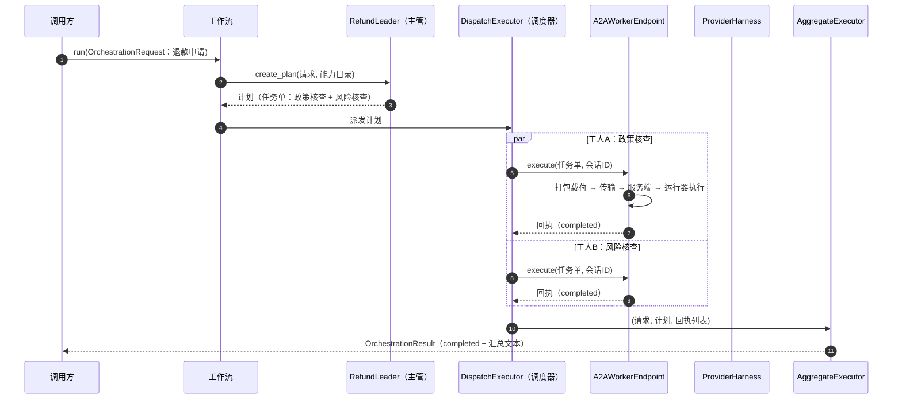
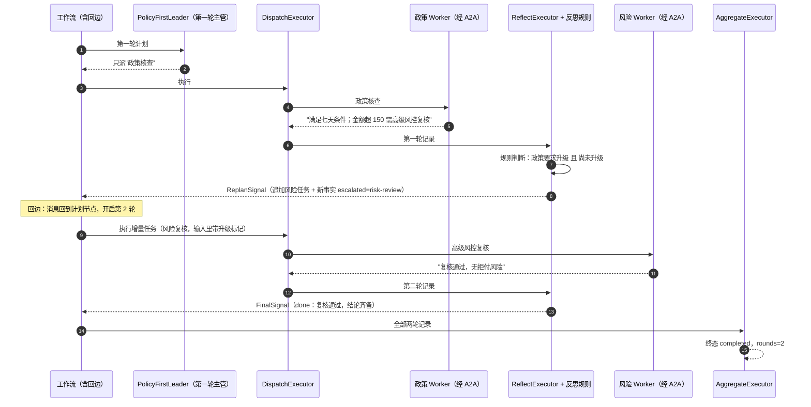
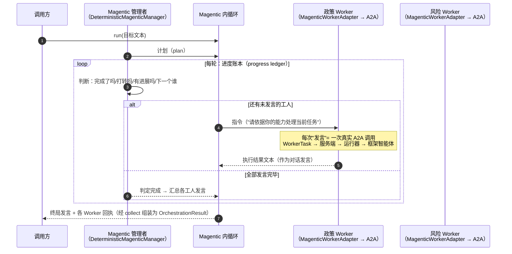
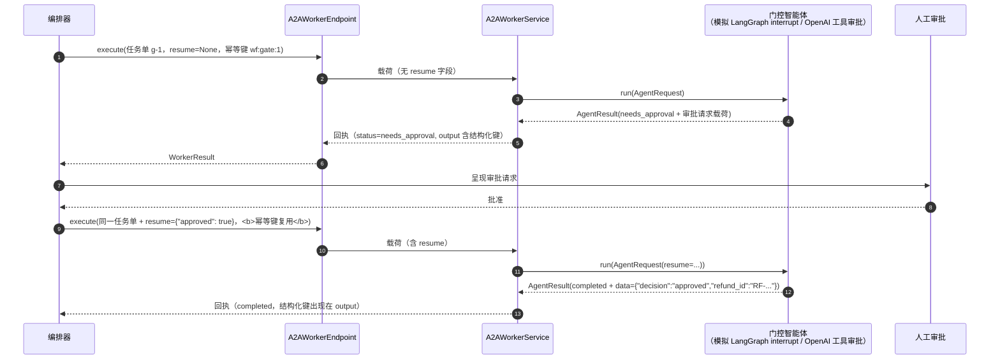
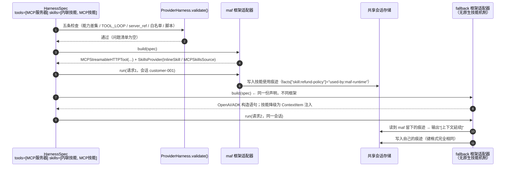
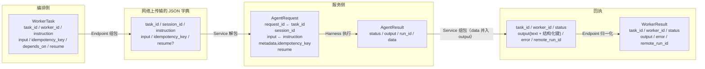

# 典型场景时序图

> 六个最常见的使用场景，每个场景一张时序图 + 三句话说明。
> 离线场景由 `tests/test_offline.py` 覆盖，图中的类名可直接在代码中定位；
> 需要真实 MCP 与 LLM 的出行场景见 `demo/react-orchestration-2-agent/`（内存 A2A）与
> `demo/react-orchestration-2-agent-fastapi/`（YAML 配置、FastAPI HTTP A2A）。

---

## 场景 1：单轮多智能体编排（主管分派 → 工人并行 → 汇总）

对应 demo 示例 1。业务：客户申请退款，需要"政策核查"和"风险核查"
两个独立检查同时进行，都完成后汇总。

三句话：主管只出计划不执行；两个工人经 A2A 协议并行执行；
聚合器按"全部成功才算完成"判定终态。

---

## 场景 2：反思循环——内置确定性引擎（第一轮发现问题 → 第二轮补充检查）

对应 demo 示例 2。业务：政策核查发现"金额超阈值需高级风控复核"，
系统自动追加一轮风险检查，而不是把整个流程失败掉。

三句话：第二轮的任务在第一轮执行前**不存在**，由反思规则基于第一轮
输出动态产生；新增的洞察（escalated=risk-review）合并进第二轮请求；
轮数上限（max_rounds）由确定性代码强制，防止无限循环。

---

## 场景 3：反思循环——Magentic 引擎（MAF 自带的多智能体循环）

对应 demo 示例 3。管理者（manager）每轮产出一个"进度账本"：
完成了吗？打转了吗？下一个谁发言？给他什么指令？

三句话：Magentic 的"参与者"就是被包装的 WorkerEndpoint，每次发言是
一次真实 A2A 调用；管理者是可替换的（demo 用确定性规则版，生产换
LLM 版）；连续打转会被 max_stall_count 护栏捕获并触发重新规划。

---

## 场景 4：人工审批与恢复（HITL，needs_approval → resume）

对应 demo 示例 5。业务：提交退款需要人工审批；审批通过后从中断处
继续执行，结构化结果全程保留。

三句话：暂停用 `status=needs_approval` 表达；恢复用 `resume` 载荷表达；
恢复时**幂等键必须复用**（同一件事），结构化键（decision/refund_id）
全程穿透协议层不丢失。

---

## 场景 5：工具与技能的声明式配置（同一声明，三种框架翻译）

对应 demo 示例 4。同一份 `HarnessSpec`（含一个 MCP 服务器 + 两个技能）
分别交给三种框架适配器构建，并演示跨框架的会话延续。

三句话：声明只有一份，翻译各干各的（有原生技能机制的翻译为原生，
没有的降级为上下文注入）；痕迹用统一的中立键格式写入会话，所以
任何框架留下的记录其他框架都读得懂——**换框架对话与能力记录都不断**。

---

## 场景 6：一次 A2A 调用的字段级数据流（协议翻译对照）

覆盖从任务单到回执的每个字段改名点（这是排查协议问题时最快的图）。

三个改名点：`instruction → input`（进 agent）、`run_id → remote_run_id`
（出 agent）、`idempotency_key → metadata`（进扩展槽）。
`resume` 单向流（请求方向），`data` 反向流（结果方向）。
