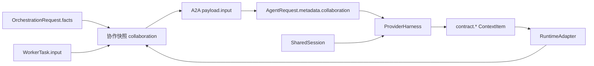

# 多智能体协作状态共享

> 本文定义多个 Worker 如何安全、可审计地共享信息，以及框架切换时哪些状态可以延续。

## 1. 两类状态，两个所有者

协作不依赖 Worker 之间持有对象引用。系统只传递中立、可序列化数据，并明确区分：

| 状态 | 所有者 | 生命周期 | 用途 |
|---|---|---|---|
| 协作快照 `collaboration` | 编排层 | 单次工作流与当前任务 | 将事实、任务输入与已产生回执交给当前 Worker |
| `SharedSession` | `SessionProvider` | 跨任务、跨工作流 | 保留业务记忆、对话记录与 runtime 审计 ID |
| runtime 私有状态 | 各 Agent runtime | runtime 自己决定 | 不跨 Worker、不写入中立契约 |

前两项可跨 AgentScope、MAF、LangGraph 等 runtime 迁移；第三项不能迁移。这样更换
某个 Worker 的实现不会让其他 Worker 依赖失效。

## 2. 协作快照协议

`DispatchExecutor` 和 `MagenticWorkerAdapter` 都调用
`collaboration.build_collaboration_input()` 创建同一格式的 `WorkerTask.input`。A2A 将其
原样放入 `AgentRequest.metadata["collaboration"]`；随后 `ProviderHarness` 无条件转换为
`ContextItem(label="contract.collaboration")`，因此协议边界不会丢失结构化输入，也不需要
任何 runtime adapter 自行认识 metadata 键。

协作快照固定包含以下键，调用方的 `WorkerTask.input` 永远放在 `task_input` 下，避免与
系统字段冲突：

| 键 | 内容 |
|---|---|
| `workflow_facts` | `OrchestrationRequest.facts` 的复制；所有任务可读取 |
| `task_input` | Leader 或 Reflector 给当前任务的私有结构化输入 |
| `prior_results` | 本任务启动前已经产生的全部 `WorkerResult`，按 `task_id` 索引 |
| `dependency_results` | `prior_results` 中且列在 `depends_on` 的子集 |

每个回执均保留 `worker_id`、`status`、`output`、`error` 与 `remote_run_id`，因而下游可
区分正常结论和失败信息，不需要把文本重新解析为事实。

## 3. 各编排模式的可见性

| `OrchestrationMode` | 启动时可见 | 执行中新增可见信息 |
|---|---|---|
| `CONCURRENT` | `workflow_facts` 与自己的 `task_input` | 无。任务同时启动，不观察彼此的中间回执。 |
| `LEADER_WORKER` | 与并行模式相同 | 后启动任务在 `prior_results` 中看到先完成的回执。 |
| `SEQUENTIAL` | 与并行模式相同 | 每个后续任务看到全部已完成回执。 |
| `HANDOFF` | 与并行模式相同 | 除全部已完成回执外，`dependency_results` 精确标出显式上游任务。 |
| `REACT` builtin | 与并行模式相同 | 轮内按序共享回执；Reflector 读取完整 `RoundRecord`，仅将确认后的新事实写入下一轮 `workflow_facts`。 |
| `REACT` Magentic | 与并行模式相同 | 所有 participant 共用编排器持有的中立结果列表；后续 participant 同时收到共享快照，MAF chat history 仍供 manager 做规划。 |

`CONCURRENT` 不会承诺实时互见，这是并发语义的必要约束。需要消费其他任务输出时，必须使用
`SEQUENTIAL`、`HANDOFF` 或 REACT；不能靠共享存储竞争读取。

## 4. Harness 会话与 runtime 切换

所有 Worker 若使用同一 `SessionProvider` 和同一 `session_id`，`ProviderHarness` 每次运行会
加载并保存同一份 `SharedSession`。它保存中立的 `facts`、`messages` 与 `runtime_references`，
因此可在下一次调用时把某个 Worker 从 AgentScope 替换为其他 runtime，而不会失去业务连续性。

`ProviderHarness` 会无条件创建三个保留 `ContextItem`：

| 标签 | 内容 |
|---|---|
| `contract.collaboration` | 当前任务的协作快照 |
| `contract.session.facts` | 跨任务、跨 runtime 的结构化长期事实 |
| `contract.session.messages` | 截至本次调用前的会话记录 |

runtime adapter 的强制义务是将完整的 `HarnessExecutionContext.context_items` 映射到框架原生
prompt、message 或 state。它不应读取 `metadata["collaboration"]`、也不应自行格式化
`SharedSession`；因此所有通过 Harness Contract 的 runtime 天然获得一致的协作与记忆输入。

`SharedSession` 不是当前工作流的自动结果总线：编排层的协作快照才是任务间即时传递回执的
唯一机制。生产 `SessionProvider` 在多个并发 Worker 共用同一 `session_id` 时，还必须提供
原子保存或乐观并发控制，避免两个 Harness 覆盖彼此的长期记忆。

## 5. 自定义 runtime adapter 的最小规则

1. 将完整的 `context.context_items` 注入其 native runtime；不得遗漏 `contract.` 前缀的保留条目。
2. 不自行读取协作 metadata 或格式化 `SharedSession`；它们已由 Harness 转为标准上下文。
3. 不将模型内部 history、图 checkpoint 或客户端连接写入 `SharedSession`。
4. 输出结构化结论时写入 `AgentResult.data`；A2A 会把它归一化到 `WorkerResult.output`，供后续任务共享。
