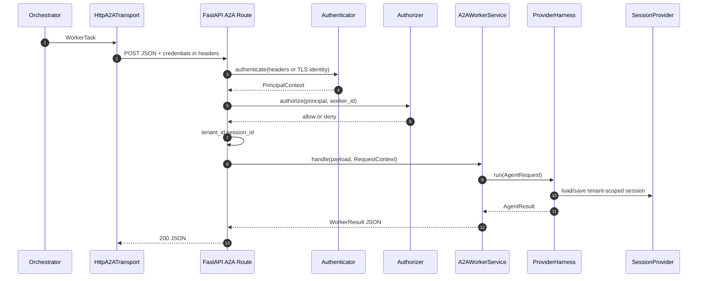

# 部署与认证指南

本指南说明 `auth-deploy` 分支如何将 Universal Contract 从本地参考实现扩展为可横向扩展的 A2A 服务。核心业务契约不因部署形态而改变：`WorkerTask`、`WorkerResult`、`Harness` 和各框架 adapter 仍保持中立；变化集中在 HTTP 边界、认证授权、会话存储与执行生命周期。

## 1. 部署 profile

| Profile | A2A transport | 身份 | 状态存储 | 适用范围 |
|---|---|---|---|---|
| `local` | `InMemoryA2ATransport` 或 `httpx.ASGITransport` | `AuthMode.NONE` | `InMemorySessionProvider` | demo、单机开发 |
| `sync-cloud` | `HttpA2ATransport` + HTTPS | Gateway 或 OIDC/mTLS | 共享 session 与幂等存储 | 短时同步 workflow |
| `async-cloud` | HTTPS Worker + 队列消费者 | Gateway 或 OIDC/mTLS | 共享 session、job 与幂等存储 | 长 REACT 流程、高并发 |

`local` 必须显式使用 `NoAuthAuthenticator` 和 `AllowAllAuthorizer`，并固定到 `local` tenant。它不是企业部署的默认降级方式。

## 2. HTTP A2A 安全边界

[deployment/fastapi_a2a.py](../deployment/fastapi_a2a.py) 的 `create_a2a_app()` 将 `A2AWorkerService` 注册为受保护的 FastAPI 路由。调用顺序如下：



认证凭据不进入 A2A JSON payload、`AgentRequest.metadata`、`SharedSession`、prompt 或日志。认证成功后仅将中立的 `RequestContext` 传给 Harness：其 `PrincipalContext` 包含 `subject`、`tenant_id`、roles、scopes 和认证方式，不包含原始 JWT、证书或 IAM 厂商 claims。

HTTP 语义固定为：缺失或无效凭据返回 `401`；已认证但没有 Worker/scope/tenant 权限返回 `403`；A2A payload 不合法返回 `400`。认证或授权失败不会伪装为 Agent 任务结果。

## 3. IAM 适配

[common/security.py](../common/security.py) 定义了不依赖任何 IAM SDK 的扩展点：

- `Authenticator`：将 HTTP headers、TLS client certificate 或可信网关上下文转换为 `PrincipalContext`。
- `Authorizer`：根据 principal、worker ID、tenant、role 或 scope 判断访问权。
- `ScopeAuthorizer`：参考实现，要求 `a2a:execute` 或 `worker:{worker_id}:execute` scope。
- `TrustedGatewayAuthenticator`：参考实现，只有请求携带部署层注入的可信网关凭据时，才读取 `X-A2A-Subject`、`X-A2A-Tenant`、`X-A2A-Roles`、`X-A2A-Scopes`。

企业部署有两种模式。

### Gateway 终止

Gateway 校验 OIDC/JWT，并通过 mTLS 或私有网络将已验证的 subject、tenant、role、scope 传给 Worker。Worker 必须验证网关来源，例如 `TrustedGatewayAuthenticator` 中的共享凭据应替换为 mTLS client identity 或网关签名。禁止让公网请求仅凭伪造的 `X-A2A-*` header 获得身份。

### Worker 直连

实现 `Authenticator`，在 Worker 内验证 OIDC JWT 的签名、JWKS、issuer、audience、expiry 与 clock skew；或将 mTLS peer certificate 的 SAN 映射为 subject/tenant/scopes。验证后只返回 `PrincipalContext`。认证实现、JWKS cache、私钥与 CA 配置属于 `deployment/` adapter 或部署基础设施，不属于 `common/contracts.py`。

客户端通过 [common/a2a.py](../common/a2a.py) 的 `HttpA2ATransport(headers_provider=...)` 注入短期 bearer token。mTLS 则通过注入已配置 client certificate、CA 验证和连接池的 `httpx.AsyncClient` 实现。token、私钥和证书路径必须来自 secret manager 或运行环境，不能写入 use case YAML。

## 4. 多租户与并发

受保护路由使用 `tenant_id:session_id` 作为传给 `SessionProvider` 的存储键。因此不同 tenant 即使传递相同 `session_id`，也不会读取到对方的 `SharedSession`。生产 `SessionProvider` 应使用此键并提供读改写并发保护，例如乐观版本号或分布式锁，防止并发请求覆盖 `messages` 和 `facts`。

不要跨 HTTP 请求复用 `ReactOrchestration`、Magentic adapter 或其回执/反思历史。每次同步请求都应创建新的 workflow 实例；Worker Harness 可以作为应用生命周期资源复用，但其 session 数据必须位于共享存储。

同步 API 应设置单次运行时限、并发限制和 per-tenant quota。超过该时限的 REACT workflow 应切换到异步作业模式：提交 API 持久化 job、tenant、幂等键和 input，队列消费者创建 workflow 执行，查询/回调 API 按 tenant 授权读取结果。不要让长 REACT loop 永久占用 Web 请求。

## 5. 本地与生产接入

[demo/react-orchestration-2-agent-fastapi](../demo/react-orchestration-2-agent-fastapi) 仍使用 `ASGITransport` 和显式无认证 profile，因此无需监听端口，适合学习协议调用链。生产服务应在启动时构建与验证 Harness，在 shutdown 时调用 `Harness.close()`，并使用 `/healthz` 和 `/readyz` 作为实例探针；`create_a2a_app()` 已提供两项探针和路由注册。

部署为独立 HTTPS Worker 后，编排器仅需将 `WorkerDescriptor.endpoint` 替换为真实 URL，并继续使用 `HttpA2ATransport`。A2A 任务和结果契约不需要变化。

## 6. 验证要求

执行：

```bash
python tests/test_offline.py
```

离线检查覆盖：HTTP credential header 不进入 JSON payload、无凭据 `401`、缺 scope `403`、可信网关校验、`RequestContext` 归一化与跨 tenant 同名 session 隔离。生产集成环境还应验证 OIDC/JWKS、mTLS、网关签名、共享存储并发、job 幂等、取消和 tenant 授权。
