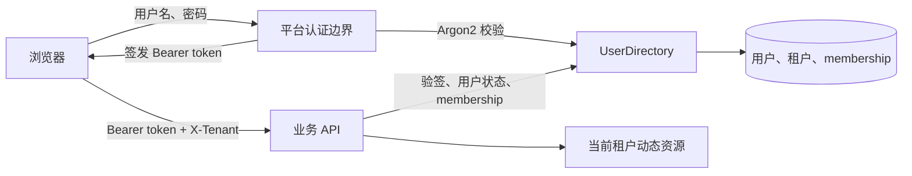

# 用户认证与隔离

本文描述数字员工平台的用户、租户、登录与动态资源隔离。它是平台参考实现，不改变
Harness、A2A 或编排层对中立契约的依赖。

## 1. 角色与边界



密码、JWT 原文与 `JWT_SECRET` 不进入 `PrincipalContext`、`AgentRequest.metadata`、
`SharedSession`、prompt 或审计业务内容。进入业务代码的是 `PrincipalContext`：user ID、当前
tenant、角色和认证方式。

## 2. 用户使用流程

1. 以 `AUTH_PROFILE=token` 启动平台，并由环境或 secret manager 提供至少 32 字节的 `JWT_SECRET`。
2. 在“身份与租户”页面注册。平台创建 `UserAccount`、`Tenant` 与 owner `Membership`，并立即登录。
3. 浏览器将 access/refresh token 和当前 `tenant_id` 保存在 session storage；业务请求附带
   `Authorization: Bearer ...` 与 `X-Tenant`。
4. 用户可在已加入的租户之间切换；服务端每次都查询 membership，不能通过篡改 header 越权。
5. 退出登录会吊销当前 access token。再次登录会获得带新 `jti` 的 token，并恢复默认 membership
   tenant 中之前创建的动态资源。

owner 可以通过 `POST /api/tenants/{tenant_id}/memberships` 将已有用户加入当前租户，角色取值为
`owner`、`member`、`viewer`。当前参考实现已记录角色并验证跨租户 membership；角色对应的同租户
资源级 ACL 是后续 `ResourceAuthorizer` 阶段，不应误认为已经完成。

## 3. HTTP 语义

| 情况 | 响应 | 含义 |
|---|---|---|
| 未携带 Bearer token | `401` + `WWW-Authenticate` | 未认证 |
| token 无效、过期或已吊销 | `401` + `WWW-Authenticate` | 无法证明请求身份 |
| token 对应用户已停用 | `401` | 用户不再有效 |
| 用户不属于 `X-Tenant` | `403` | 已认证但没有租户归属 |
| 已归属 tenant | `2xx` | 仅访问该 tenant 的动态资源 |

内置 Worker 是平台预设，不属于某个用户创建的资源；动态 Worker、Skill、MCP Server、编排记录
和持久会话按 tenant 查询。因而租户 A 看不到租户 B 创建的同名资源。

## 4. 替换路径

| 当前参考实现 | 可替换实现 | 上层无需改变 |
|---|---|---|
| `SqlAlchemyUserDirectory` | 企业用户目录、LDAP/SCIM 同步目录 | `UserDirectory` / `CredentialVerifier` |
| `JwtTokenService`（HS256） | OIDC、opaque token、非对称 JWT | `TokenService` |
| `InMemoryTokenRevocation` | Redis、数据库、集中式会话服务 | `TokenRevocation` |

生产应使用 HTTPS，并将密钥、OIDC client secret、证书等交给 Secret Manager、Vault、KMS 或部署
平台管理。不要将 `JWT_SECRET` 写入前端、镜像层、源码或 Git。

## 5. 验证

平台离线集成测试覆盖：无 token 为 `401`、注册后的 tenant 资源可创建、其他租户读取为 `404`、
伪造 `X-Tenant` 为 `403`、logout 后旧 token 为 `401`，以及重新登录后先前创建的 Worker 仍可见。
运行方式：

```bash
cd demo/digital-workforce-platform
PYTHONPATH=backend:../.. python backend/tests/test_offline.py
```