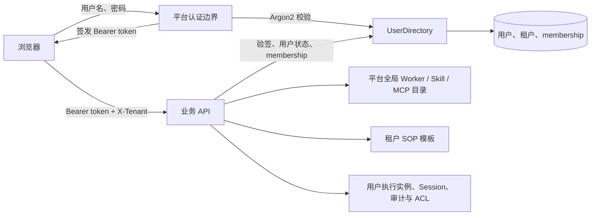

# 用户认证与隔离

本文描述数字员工平台的用户、租户、登录与工作状态隔离。它是平台参考实现，不改变
Harness、A2A 或编排层对中立契约的依赖。

## 1. 角色与边界


```mermaid
flowchart LR
    Browser[浏览器] -->|用户名、密码| Auth[平台认证边界]
    Auth -->|Argon2 校验| Directory[UserDirectory]
    Directory --> Database[(用户、租户、membership)]
    Auth -->|签发 Bearer token| Browser
    Browser -->|Bearer token + X-Tenant| Api[业务 API]
    Api -->|验签、用户状态、membership| Directory
   Api --> Catalog[平台全局 Worker / Skill / MCP 目录]
   Api --> Templates[租户 SOP 模板]
   Api --> State[用户执行实例、Session、审计与 ACL]
```

密码、JWT 原文与 `JWT_SECRET` 不进入 `PrincipalContext`、`AgentRequest.metadata`、
`SharedSession`、prompt 或审计业务内容。进入业务代码的是 `PrincipalContext`：user ID、当前
tenant、角色和认证方式。

## 2. 用户使用流程

1. 以 `AUTH_PROFILE=token` 启动平台，并由环境或 secret manager 提供至少 32 字节的 `JWT_SECRET`。
2. 在“身份与租户”页面注册。平台创建 `UserAccount`、`Tenant` 与 owner `Membership`，并立即登录。
3. 浏览器将 access/refresh token 和当前 `tenant_id` 保存在 session storage；业务请求优先附带
   `Authorization: Bearer ...` 与 `X-Tenant`。登录、注册和刷新响应还会写入同源、HttpOnly、`SameSite=Lax`
   的短期 access cookie，作为 SSE 等浏览器自动连接无法稳定附加自定义 header 时的后备认证方式。
4. 用户可在已加入的租户之间切换；服务端每次都查询 membership，不能通过篡改 header 越权。
5. 退出登录会吊销当前 access token。再次登录会获得带新 `jti` 的 token，并恢复该用户在默认
   membership tenant 下的任务和会话。

owner 可以在“身份与租户”页面添加已有用户，也可通过 `POST /api/tenants/{tenant_id}/memberships` 自动化管理成员，角色取值为
`owner`、`member`、`viewer`。membership 解决“用户是否属于租户”；它不直接替代执行实例的资源授权。

## 3. HTTP 语义

| 情况 | 响应 | 含义 |
|---|---|---|
| 未携带 Bearer token | `401` + `WWW-Authenticate` | 未认证 |
| token 无效、过期或已吊销 | `401` + `WWW-Authenticate` | 无法证明请求身份 |
| token 对应用户已停用 | `401` | 用户不再有效 |
| 用户不属于 `X-Tenant` | `403` | 已认证但没有租户归属 |
| 已归属 tenant | `2xx` | 可使用平台目录，并按模板与实例 ACL 访问当前租户的数据 |

## 3. 资源边界与授权

| 层级 | 资源 | 所有者与可见范围 | 当前实现 |
|---|---|---|---|
| L1 | 执行实例、事件、审批、会话 | 创建用户私有；owner 可显式共享给同租户成员 | 已实现 `viewer`、`approver`、`collaborator` ACL |
| L2 | `ProcessTemplate` / SOP | 租户 owner 定义、修改、发布；成员只能查看和使用已发布版本 | 已实现草稿、发布、版本递增与执行快照 |
| L3 | Worker、Skill、MCP Server 定义 | 平台共享目录 | 已实现；当前不做租户能力 allowlist |
| L4 | MCP 凭据、企业连接器绑定 | 租户专属基础设施 | 预留，尚未实现 |

内置和动态 Worker、Skill、MCP Server 都是平台全局能力目录，可被任意已认证租户选择使用。租户承载
`system_prompt` 工作规则；运行时将它追加到每个员工的系统提示词。MCP 的全局定义不得保存租户私有
密钥、连接串或账户身份，这些信息应由后续 tenant connector binding 单独托管。

`ProcessTemplate` 的定义包含编排模式、参与 Worker、默认 facts 与 REACT 配置。owner 编辑模板时版本递增；
只有 `published` 模板可被 member 用于创建任务。任务创建时保存 template ID、版本及定义快照，后续修改
模板不会改变历史或正在执行的任务。

编排记录与持久会话按 `tenant_id + owner_user_id + session_id` 隔离。因而租户 A 的用户无法读取租户 B
的数据；同一租户内的另一用户默认也无法读取。实例 owner 可通过
`POST /api/orchestrations/{orchestration_id}/access` 向同租户成员授予：`viewer`（查看）、`approver`（查看和
审批）、`collaborator`（查看、审批和续办）。取消仅限实例 owner。输入、输出、事件、审批和审计随实例
tenant 边界保存。全局目录的精细发布和编辑权限仍是后续 `CatalogAuthorizer` 的职责。

## 4. 替换路径

| 当前参考实现 | 可替换实现 | 上层无需改变 |
|---|---|---|
| `SqlAlchemyUserDirectory` | 企业用户目录、LDAP/SCIM 同步目录 | `UserDirectory` / `CredentialVerifier` |
| `JwtTokenService`（HS256） | OIDC、opaque token、非对称 JWT | `TokenService` |
| `InMemoryTokenRevocation` | Redis、数据库、集中式会话服务 | `TokenRevocation` |

生产应使用 HTTPS，并将密钥、OIDC client secret、证书等交给 Secret Manager、Vault、KMS 或部署
平台管理。不要将 `JWT_SECRET` 写入前端、镜像层、源码或 Git。

## 5. 验证

平台离线集成测试覆盖：无 token 为 `401`、全局 Worker 可被其他租户使用、同租户未授权成员读取实例为
`404`、伪造 `X-Tenant` 为 `403`、logout 后旧 token 为 `401`，以及租户系统提示词保存。模板 owner/member
权限、模板版本快照和实例 ACL 的端到端测试应随生产接入继续扩展。
运行方式：

```bash
cd demo/digital-workforce-platform
PYTHONPATH=backend:../.. python backend/tests/test_offline.py
```