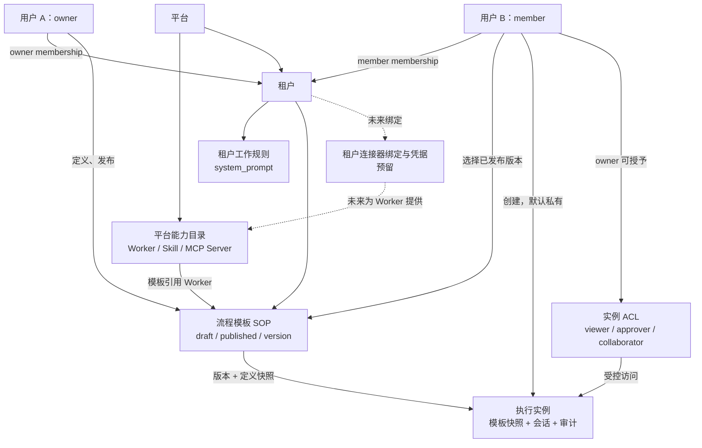
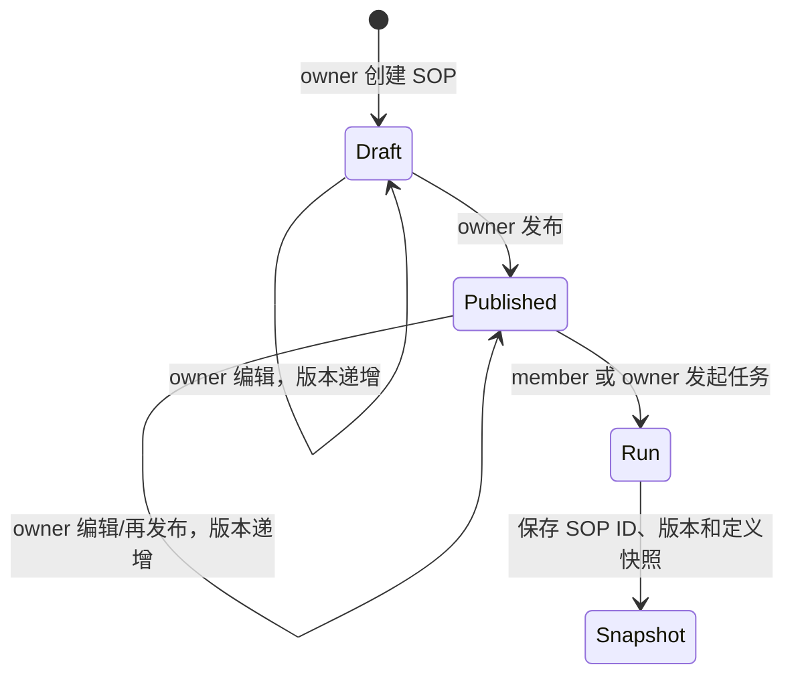

# 平台租户与资源模型

本文说明 `digital-workforce-platform` 中用户、租户、流程模板、数字员工、执行实例及连接器资源的边界。
它描述的是平台控制面，不改变 UniversalContract 的 `Harness`、A2A、会话和编排中立契约。

## 1. 一句话模型

- **用户**是登录和审计主体。
- **租户**是成员关系、业务规则和 SOP 的组织边界。
- **流程模板（ProcessTemplate / SOP）**是 tenant owner 定义、成员复用的业务流程资产。
- **数字员工、Skill、MCP Server**是平台共享的能力目录，不属于某一个租户。
- **执行实例（Orchestration）**由用户从 SOP 创建，默认私有，可由实例 owner 显式共享。
- **连接器凭据与企业账户绑定**应是租户专属资源，但当前参考实现仅预留该层。

## 2. 对象关系

该图的独立源文件见 [09_平台租户与资源模型.mmd](09_平台租户与资源模型.mmd)。

## 3. 四层资源边界

| 层级 | 资源 | 归属 | 典型操作 | 当前状态 |
|---|---|---|---|---|
| L1 | 执行实例、事件、审批、`SharedSession` | 创建用户 | 创建、查看、续办、取消、共享 | 已实现；默认私有 + ACL |
| L2 | SOP 模板、租户工作规则 | 租户 | 定义、编辑、发布、复用 | 已实现；owner 管理模板 |
| L3 | Worker、Skill、MCP Server 定义 | 平台 | 注册、更新、探测、复用 | 已实现；全局目录 |
| L4 | MCP 凭据、SaaS 账户、网络连接器绑定 | 租户 | 授权、轮换、撤销、审计 | 预留，未实现 |

L1 与 L2 是业务数据边界：SOP 不能跨 tenant 查看或使用，执行实例和会话也不能跨 tenant 访问。
L3 是能力定义边界：员工的代码、说明、Skill 与 MCP 端点配置可以复用，但不能携带某个 tenant 的密钥。
L4 将来保存 tenant 私有的凭据和账户绑定，以避免把密钥误放进全局 MCP 目录。

## 4. 身份、membership 与资源 ACL

membership 回答“**用户是否属于租户，以及是否能管理该租户 SOP**”；实例 ACL 回答“**这个已创建的执行实例是否能被该用户操作**”。二者不能互相替代。

| 操作 | tenant owner | tenant member | 未加入 tenant 的用户 |
|---|---|---|---|
| 查看平台 Worker/Skill/MCP 目录 | 可以 | 可以 | 不可以 |
| 创建、编辑、发布 SOP | 可以 | 不可以 | 不可以 |
| 查看已发布 SOP | 可以 | 可以 | 不可以 |
| 从已发布 SOP 创建执行实例 | 可以 | 可以 | 不可以 |
| 查看自己的执行实例 | 可以 | 可以 | 不可以 |
| 查看其他用户实例 | 仅获得 ACL 时 | 仅获得 ACL 时 | 不可以 |
| 取消实例 | 实例 owner | 实例 owner | 不可以 |
| 审批实例 | 实例 owner 或 `approver` / `collaborator` | 同左 | 不可以 |
| 续办实例 | 实例 owner 或 `collaborator` | 同左 | 不可以 |

实例 ACL 的含义如下：

| ACL | 可读取详情、事件、会话 | 可处理审批 | 可续办 | 可取消 |
|---|---|---|---|---|
| `viewer` | 是 | 否 | 否 | 否 |
| `approver` | 是 | 是 | 否 | 否 |
| `collaborator` | 是 | 是 | 是 | 否 |
| 实例 owner | 是 | 是 | 是 | 是 |

当前实现通过 `POST /api/orchestrations/{orchestration_id}/access` 授予或更新 ACL。被授权用户必须已经
属于同一 tenant；跨 tenant 授权在 API 边界被拒绝。

## 5. SOP 生命周期与执行快照

SOP 定义包括编排模式、参与 Worker、默认 facts 及 REACT 配置。创建执行实例时，平台写入
`template_id`、`template_version` 和 `template_snapshot_json`。因此：

1. 更新 SOP 会生成新的版本，不会改写已有执行实例。
2. 历史审计可还原当时实际使用的流程配置。
3. 续办 tenant SOP 创建的实例时，继续使用原始快照；修改后的模板只影响新建实例。

## 6. 三个使用场景

### 场景 A：租户 owner 发布报销核验 SOP

1. Owner 在全局员工目录中选择“政策核验”和“风险复核” Worker。
2. Owner 创建“报销核验” SOP，配置顺序编排，先保存草稿后发布。
3. Member 在“发起任务”只能看到发布版本，填写本次报销目标并创建自己的执行实例。
4. 平台将该 SOP 的版本和配置快照写入实例，以便后续追溯。

### 场景 B：成员协作与人工审批

1. 用户 A 创建执行实例，实例只对 A 可见。
2. A 在任务详情将用户 B 授权为 `approver`。
3. B 可读取执行轨迹并处理 `needs_approval`，但不能续办或取消该实例。
4. A 若希望 B 基于既有会话创建后续工作，可将权限提升为 `collaborator`。

### 场景 C：两个租户复用平台能力而不泄漏业务数据

1. 租户甲和租户乙都可在目录中选择同一个通用“报告撰写” Worker。
2. 两个租户各自维护 SOP、工作规则、执行实例与会话；同名 session ID 也由 tenant 与 owner 用户隔离。
3. Worker 的定义不保存任一租户的 API key、客户数据或企业账户。
4. 将来由 L4 tenant connector binding 提供各自的 SaaS 授权和凭据，而不改变 Worker/SOP 的公共定义。

## 7. 当前边界与后续演进

- 平台共享 Worker 并不表示每个 tenant 都应能使用每个 Worker。tenant capability allowlist / `CatalogAuthorizer` 是下一阶段工作。
- MCP 的 URL、transport 与工具白名单是全局目录配置；tenant 私有 token、连接串和账户身份必须等待 L4 binding 实现。
- membership 的 `viewer` 角色当前表达租户成员关系，不应与实例的 `viewer` ACL 混淆；实例访问始终由显式 ACL 或 owner 身份决定。
- SQLite 参考实现用于本地演示。生产环境应将身份、模板、实例、审计和会话迁移到具备备份、并发控制和访问审计能力的共享存储。

认证细节见 [用户认证与隔离](08_用户认证与隔离.md)，本地运行见
[数字员工平台 README](../demo/digital-workforce-platform/README.md)，部署建议见
[部署与认证指南](07_部署与认证指南.md)。