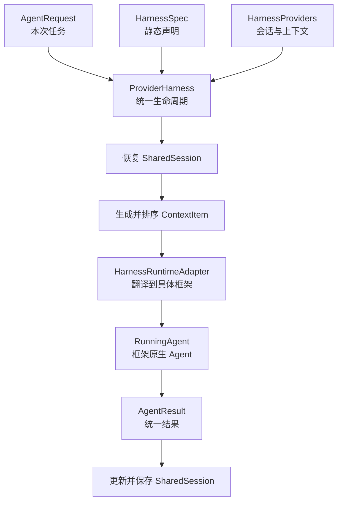
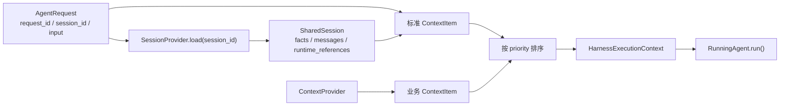

# Harness 组件抽象说明

## 1. Harness 是什么

可以把一个 AI Agent 想成一位会完成任务的专家，而 **Harness** 是它外面的标准工作台。
工作台不关心专家是用 AgentScope、LangGraph 还是 OpenAI SDK 训练的；它只负责让每次工作都按同一套流程完成：

1. 找回这次会话此前的业务事实和对话；
2. 补齐编排器传来的协作信息，以及业务系统提供的额外上下文；
3. 交给对应框架的 Agent 执行；
4. 将回答和运行记录保存回共享会话。

这样，编排层和 A2A 服务只面对统一的数据结构，框架相关的对象被限制在适配器内。替换底层框架时，任务、会话和审计记录不需要随之改写。



## 2. 组件分工

| 组件 | 通俗理解 | 负责什么 | 不负责什么 |
|---|---|---|---|
| `HarnessSpec` | Agent 的出生证明 | 身份、系统指令、需要的能力、工具、技能、模型服务配置 | 保存某次对话的历史 |
| `HarnessProviders` | 工作台接入的基础设施 | 提供会话读写能力和额外上下文来源 | 决定如何调用模型 |
| `ProviderHarness` | 工作台主管 | 编排一次调用的固定步骤、启动前校验、懒加载、会话记账 | 理解任一 AI 框架的原生 API |
| `HarnessRuntimeAdapter` | 翻译员 | 将中立声明翻译为 AgentScope/LangGraph/OpenAI 等原生对象 | 直接处理 A2A 或编排协议 |
| `RunningAgent` | 已经就位的专家 | 接收统一上下文并实际执行，返回统一结果 | 管理共享会话的保存规则 |
| `SharedSession` | 跨轮次的业务笔记本 | 保存可序列化的业务事实、对话记录、运行 ID | 保存框架私有对象或密钥 |
| `ContextProvider` | 临时资料提供者 | 按本次请求和历史会话提供租户规则、RAG 结果等内容 | 覆盖 Harness 保留的协作和会话上下文 |

`ProviderHarness` 的关键价值是将“每次都要做，但不属于 Agent 推理本身”的动作集中到一个地方。各 adapter 因而只做一件事：翻译并运行。

## 3. 关键数据如何设计

### 3.1 静态声明与动态状态分开

`HarnessSpec` 是静态配置，描述 Agent **能做什么**；`AgentRequest`、`SharedSession` 和 `ContextItem` 是运行时数据，描述 Agent **这次面对什么、此前发生了什么**。

| 数据结构 | 主要字段 | 设计意图 |
|---|---|---|
| `AgentIdentity` | `agent_id`、`name`、`description` | 用稳定 ID 做机器识别，用名称和描述方便人理解 |
| `LlmServingSpec` | `model`、`base_url`、`api_key`、超时与采样参数 | 每个 Agent 可连接不同模型服务；密钥只供 adapter 本地创建客户端，不进入请求和会话 |
| `McpServerSpec` | 传输方式、地址、白/黑名单、超时、审批要求 | 用纯数据描述外部工具，adapter 再按框架转换为 MCP 客户端或工具箱 |
| `SkillSpec` | 来源、路径/内容、关联 MCP、允许工具 | 将“操作说明书”与“可调用工具”区分开；脚本执行默认关闭 |
| `Capability` | `TOOL_LOOP`、`DURABLE_SESSION`、`STRUCTURED_OUTPUT` 等 | 用能力集合让 `validate()` 在启动前发现“声明需要、adapter 不支持”的组合 |

### 3.2 请求、会话和上下文的关系



其中三个 `contract.*` 条目由 Harness 无条件产生，所有合规 adapter 都应完整注入到原生 prompt、message 或 state：

| 保留标签 | 内容来源 | 用途 |
|---|---|---|
| `contract.collaboration` | `AgentRequest.metadata["collaboration"]` | 当前工作流事实、任务输入、前序 Worker 回执 |
| `contract.session.facts` | `SharedSession.facts` | 跨请求可复用的结构化业务事实 |
| `contract.session.messages` | `SharedSession.messages` | 已发生的中立对话记录 |

`SharedSession` 只保存字符串、字典、列表等中立且可序列化的数据。LangGraph checkpoint、AgentScope 内存对象、HTTP 连接等框架私有状态不得写入其中；若需要追溯，可在 `runtime_references` 中仅记录 `run_id` 等标识符。

## 4. 一次调用如何完成

`ProviderHarness.run(request)` 的调用链可以直接理解为下面八步：

1. 用 `request.session_id` 从 `SessionProvider` 恢复会话。
2. 从协作快照、会话事实、会话消息生成三个标准 `ContextItem`。
3. 调用每个 `ContextProvider` 收集业务扩展内容。
4. 按 `ContextItem.priority` 排序，数值越小越先交给 Agent。
5. 组装 `HarnessExecutionContext`，作为 adapter 可见的完整中立输入。
6. 首次调用时执行 `runtime.build(spec, providers)`；之后复用缓存的 `RunningAgent`。
7. 调用 `RunningAgent.run(context)`，拿到 `AgentResult`。
8. 把用户输入、最终输出和 runtime 的 `run_id` 写回 `SharedSession`，保存后再返回结果。

这个顺序有两个实际好处：一是 `build()` 懒加载，提前装配很多 Agent 不会马上建立模型或 MCP 连接；二是先保存会话再返回，保存失败不会把一次未记账的执行伪装成成功。

## 5. Runtime Adapter 的抽象

接入一个新框架，只需要实现四个成员：

```python
class MyRuntimeAdapter:
    runtime_name = "my-framework"

    def capabilities(self) -> frozenset[Capability]: ...

    async def build(
        self, spec: HarnessSpec, providers: HarnessProviders
    ) -> RunningAgent: ...

    async def close(self) -> None: ...
```

`build()` 是唯一的“翻译现场”。例如，`AgentScopeMcpRuntimeAdapter` 会将 `McpServerSpec` 转成 AgentScope 的 `MCPClient`，再组装为 `Toolkit` 和带 ReAct 配置的原生 `Agent`；`McpOpenAICompatibleRuntimeAdapter` 则将运行时发现的 MCP 工具 Schema 转成 OpenAI function calling 的工具描述。

无论底层实现不同，最终都应产出 `RunningAgent`。它只接收 `HarnessExecutionContext`，并返回 `AgentResult`，从而把框架类型隔离在 adapter 文件内。

## 6. 如何组织一个 Harness Agent

下面是一个带 MCP 工具的 AgentScope Harness agent 的组织方式。对象依赖始终从“纯数据声明”流向“框架原生实现”：

```python
spec = HarnessSpec(
    identity=AgentIdentity("map-worker", "地图助手"),
    instructions="查询实时地图信息时使用 MCP 工具。",
    requested_capabilities=frozenset({Capability.TOOL_LOOP}),
    tools=(McpServerSpec(
        name="amap",
        transport=McpTransport.STREAMABLE_HTTP,
        url="https://mcp.example.com",
        allowed_tools=frozenset({"maps_geo"}),
    ),),
    llm_serving=serving,
)

providers = HarnessProviders(
    session=InMemorySessionProvider(),
    contexts=(StaticContextProvider("answer-policy", "请用中文回答。"),),
)

agent = ProviderHarness(
    spec,
    providers,
    AgentScopeMcpRuntimeAdapter(native_model, max_tool_rounds=6),
)
```

组织时遵循这四条即可：

1. **先写声明**：身份、指令、能力、MCP、技能和 Serving 都放入 `HarnessSpec`，不要把框架对象混进去。
2. **再接基础设施**：用 `HarnessProviders` 放会话存取和业务上下文；多个 Worker 复用同一会话 Provider 与 `session_id` 时，可共享中立业务连续性。
3. **最后选 adapter**：无工具的 AgentScope Agent 使用 `AgentScopeRuntimeAdapter`；需要 AgentScope MCP 工具循环时使用 `AgentScopeMcpRuntimeAdapter`；OpenAI 兼容实现也有对应 adapter。
4. **启动前校验、退出时关闭**：先调用 `await agent.validate()`，有问题则不要运行；在 `finally` 中调用 `await agent.close()` 释放 adapter 管理的资源。

实际调用只需创建请求：

```python
result = await agent.run(AgentRequest(
    request_id="map-001",
    session_id="customer-42",
    input="查询北京长春桥的位置。",
))
```

同一个 `session_id` 的后续请求会恢复 `SharedSession`，Harness 再把历史以标准上下文交给 adapter。由此得到的效果是：上层始终按同一种方式调用 Agent，底层可以演进为不同框架和不同工具组合。

## 7. 边界速记

- 编排器负责“该找哪个 Worker、任务之间什么顺序”；Harness 负责“一个 Worker 的一次调用如何可靠完成”。
- A2A 负责“任务如何跨进程或跨网络送达”；Harness 负责“收到任务后如何运行 Agent”。
- adapter 负责“中立数据如何翻译成框架对象”；`ProviderHarness` 负责“会话、上下文和结果如何统一管理”。
- 共享会话保存中立业务数据；框架私有内存和连接留在框架 runtime 内。

这几个边界不重叠，正是 Harness 可以接住不同 Agent 框架、同时保持调用方式稳定的原因。