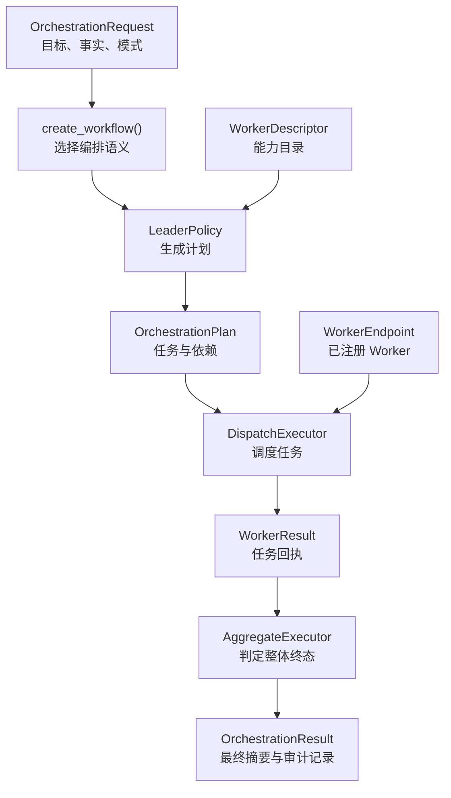
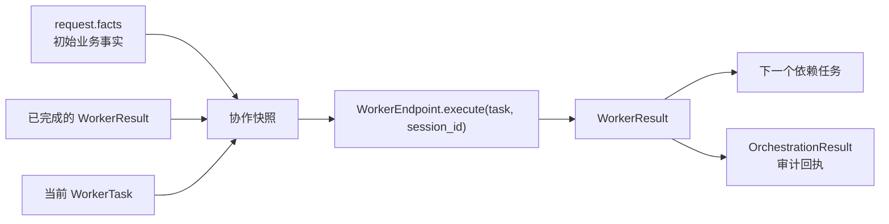
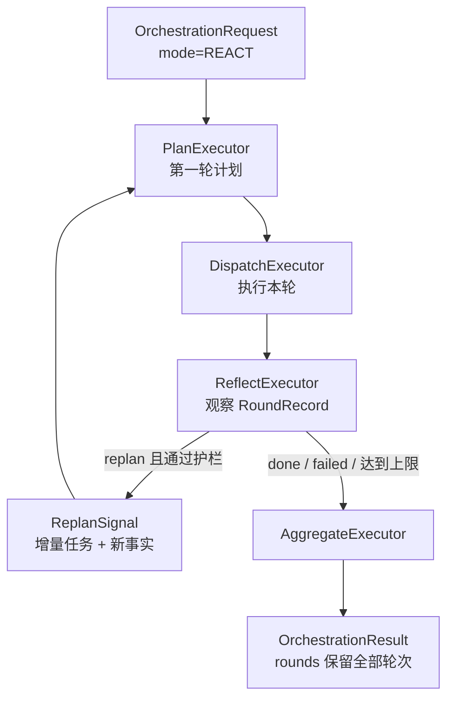

# Orchestration 组件抽象说明

## 1. Orchestration 是什么

可以把多个 Harness Agent 想成一个专家小组：有人查政策、有人评估风险、有人整理答案。**Orchestration（编排层）** 就是小组的项目经理。它不替任何专家完成业务，而是负责回答四个问题：

1. 这次目标应该拆成哪些任务；
2. 每个任务该交给哪个已注册的 Worker；
3. 哪些任务可以并行，哪些必须等待前序结果；
4. 收到所有回执后，整个工作流是完成、失败，还是需要人工审批。

编排层只依赖 `WorkerEndpoint` 这一统一调用接口。Worker 背后可以是本地 Harness、A2A 远程服务、AgentScope 或 LangGraph，编排层都不需要知道。这让“如何协作”和“一个 Agent 如何执行”保持独立。



上图是单轮编排的主干。REACT 模式会在调度后增加“反思并决定是否再规划”的循环，后文会单独说明。

## 2. 组件分工

| 组件 | 通俗理解 | 负责什么 | 不负责什么 |
|---|---|---|---|
| `OrchestrationRequest` | 项目委托单 | 工作流 ID、共享会话、目标、业务事实、协作模式 | 描述每个 Worker 的框架实现 |
| `LeaderPolicy` | 任务规划者 | 根据目标与能力目录生成计划 | 直接调用 Worker |
| `WorkerDescriptor` | 专家通讯录 | Worker ID、地址、能力和边界说明 | 持有可调用的 Worker 对象 |
| `WorkerEndpoint` | 专家的统一电话 | 接收任务单与会话 ID，执行并返回回执 | 决定整体任务顺序 |
| `DispatchExecutor` | 调度员 | 按计划串行或并行调用 Worker，并传递前序回执 | 生成业务计划 |
| `AggregateExecutor` | 项目验收人 | 根据回执和完成规则计算工作流终态、生成摘要 | 再次派发任务 |
| `ReflectionPolicy` | 复盘者 | 在 builtin REACT 引擎中决定继续、结束或失败 | 绕过目录直接调用 Worker |
| `ReactOrchestration` | 循环工作流句柄 | 统一 reset 与 finalize，屏蔽 REACT 引擎差异 | 承担某个 Worker 的业务推理 |

其中最关键的隔离是：`LeaderPolicy` 和 `ReflectionPolicy` 只能看到 `WorkerDescriptor` 列表，不能得到 `WorkerEndpoint` 实例。因此即使规划策略由 LLM 驱动，它也无法绕过调度器，直接发起网络调用。

## 3. 关键数据如何设计

### 3.1 从目标到结果的数据链

| 数据结构 | 主要字段 | 设计意图 |
|---|---|---|
| `OrchestrationRequest` | `workflow_id`、`session_id`、`goal`、`facts`、`mode` | 一次业务事务的入口；`facts` 是所有 Worker 可共享的初始事实 |
| `WorkerDescriptor` | `worker_id`、`endpoint`、`capabilities`、`description` | 给规划者看的能力卡片；地址是字符串而非对象引用，Worker 可远程部署或独立换框架 |
| `WorkerTask` | `task_id`、`worker_id`、`instruction`、`input`、`idempotency_key`、`depends_on` | 一张可审计的任务单；幂等键防止网络重试造成重复副作用 |
| `OrchestrationPlan` | `plan_id`、`mode`、`tasks`、`completion_rule`、`round` | 明确要做什么、怎样调度，以及所有任务成功还是任一成功才算达标 |
| `WorkerResult` | `task_id`、`status`、`output`、`error`、`remote_run_id` | 单个 Worker 的规范化回执；失败也数据化，不让整个流程失去审计信息 |
| `RoundRecord` | `round`、`plan`、`results` | REACT 每轮的完整快照，供反思器观察并追溯 |
| `OrchestrationResult` | `status`、`summary`、`worker_results`、`rounds` | 对调用方的统一终态；摘要给人读，回执和轮次给系统审计 |

### 3.2 任务单为什么要有依赖和幂等键

`depends_on` 描述的是**数据依赖**。例如航班查询需要先得到天气 Worker 选出的日期，则航班任务依赖天气任务。调度器只有在依赖任务成功后才会启动下游任务。

`idempotency_key` 描述的是**可靠性边界**。网络超时不能说明远端没有执行；恢复或重试同一业务意图时必须复用同一个键，让 Worker 能识别重复提交。只有产生新的业务意图，才应创建新的任务 ID 和幂等键。

### 3.3 协作信息如何传递

调度器不会把前序结果拼成随意的提示词，而是先用 `build_collaboration_input()` 生成结构化协作快照，再放入当前 `WorkerTask.input`。因此下游 Worker 可区分：初始业务事实、自己的任务输入、以及哪些前序 Worker 已完成并给出了什么回执。



这条链与 Harness 的共享会话互补：工作流内的即时协作信息走任务输入；跨请求的中立业务连续性由同一个 `session_id` 对应的 `SharedSession` 保存。

## 4. 编排模式与执行方式

`OrchestrationMode` 表达的是协作语义，而不是底层框架选择：

| 模式 | 适用场景 | `DispatchExecutor` 的行为 |
|---|---|---|
| `LEADER_WORKER` | 主管拆分任务，收齐后汇总 | 按计划顺序执行 |
| `SEQUENTIAL` | 每一步都依赖上一步 | 逐项检查 `depends_on` 后执行 |
| `CONCURRENT` | 多项任务互不依赖 | 用 `asyncio.gather` 并发执行；所有任务看到同一初始事实快照 |
| `HANDOFF` | 任务像接力一样传递产出 | 按依赖顺序执行，后续任务可读取前序回执 |
| `REACT` | 目标不确定，需要边做边调整 | 执行一轮后反思，决定继续规划或收敛 |

前四种都是单轮工作流：`plan -> dispatch -> aggregate`。`completion_rule="all"` 时，一个任务失败会使顺序调度短路；但失败会作为 `WorkerResult(status="failed")` 留给聚合器，而不是丢失上下文。最终状态的优先级是：`needs_approval` 高于失败，高于完成。

## 5. REACT 循环的两种实现

REACT 的语义始终是“计划/执行一轮，观察结果，再决定下一步”，实现引擎可替换：



1. **`engine="builtin"`**：使用项目内确定性工作流图。第一轮由 `LeaderPolicy` 出计划，后续由 `ReflectionPolicy` 提供增量任务。`ReflectExecutor` 对反思提案设置硬护栏：最大轮数、单轮最大任务数、不得空转。适合离线测试，或反思规则可明确编码的流程。
2. **`engine="magentic"`**：使用 Microsoft Agent Framework 的 Magentic 编排器。`MagenticWorkerAdapter` 将 `WorkerEndpoint` 翻译为 participant；manager 每轮从参与者能力卡片选择下一位发言者。它同样限制 participant 必须来自注册 Worker，并默认拒绝有写入、支付、退款提交、账户修改等高危能力的 Worker。

两种引擎都通过 `ReactOrchestration` 返回统一结果。builtin 引擎的终局已是 `OrchestrationResult`；Magentic 的终局是 manager 文本，`finalize()` 会结合各 adapter 收集的 `WorkerResult` 还原公开结果。

同一个 REACT workflow 重复运行前，应调用 `orchestration.reset()`。这是因为反思器历史或 Magentic participant 的轮次记录是实例状态，不能带入下一次业务事务。

## 6. 如何组织一组 Orchestration Agent

下面用“政策判断 + 风险评估”的两位 Worker 展示组织顺序。重点是先建立 Worker 的稳定能力目录，再装配执行入口，最后把计划策略交给工厂函数：

```python
request = OrchestrationRequest(
    workflow_id="refund-001",
    session_id="customer-42",
    goal="判断这笔退款是否符合政策，并评估风险。",
    facts={"order_id": "ORD-1001", "amount": 199},
    mode=OrchestrationMode.HANDOFF,
)

workers = [policy_endpoint, risk_endpoint]

workflow = create_workflow(
    request,
    workers,
    leader=refund_leader,
)

events = await workflow.run(request)
result = list(events.get_outputs())[-1]
```

这里的 `policy_endpoint` 和 `risk_endpoint` 通常由以下层次组装而来：

1. 每个业务专家先由 `HarnessSpec + HarnessProviders + RuntimeAdapter` 组成 `ProviderHarness`。
2. 用 `A2AWorkerService` 暴露该 Harness，再用 `A2AWorkerEndpoint` 将服务包装成 `WorkerEndpoint`。
3. 为 endpoint 配置精确的 `WorkerDescriptor.capabilities` 与 `description`，让 Leader 能正确选人，也让边界可审计。
4. 将 endpoint 列表和 `LeaderPolicy` 交给 `create_workflow()`；工厂根据 `request.mode` 创建匹配的工作流，并校验 Leader 产出的模式没有漂移。

若业务目标需要多轮探索，改为 `mode=OrchestrationMode.REACT`，并显式选择引擎：

```python
orchestration = create_react_workflow(
    workers,
    engine="builtin",
    leader=refund_leader,
    reflector=refund_reflector,
    max_rounds=4,
    max_tasks_per_round=8,
)

events = await orchestration.workflow.run(request)
result = await orchestration.finalize(request, events)
```

无论使用哪种模式，调用方最终只处理 `OrchestrationResult`，无需感知 Worker 是否远程、其 Harness 使用了什么框架，或 REACT 使用了哪种内部引擎。

## 7. 边界速记

- Harness 负责一个 Agent 的会话、上下文注入、框架适配和单次执行；Orchestration 负责多个 Worker 的任务分配、顺序和汇总。
- Leader 负责提出计划；DispatchExecutor 负责严格执行计划。Leader 无权直接调用 Worker。
- `WorkerDescriptor` 是能力目录，`WorkerEndpoint` 才是执行入口；前者给策略看，后者只给调度器用。
- 失败、审批和反思结论都以结构化数据继续流动，避免异常中断后无法得出可审计终态。
- REACT 的引擎可以替换，但公开请求和结果契约保持不变。

这些边界让系统可以独立演进 Worker 框架、规划策略与 REACT 实现，同时保持上层调用方式稳定。