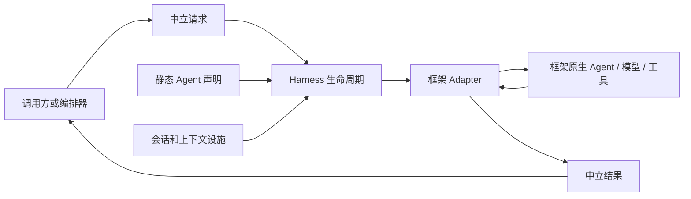
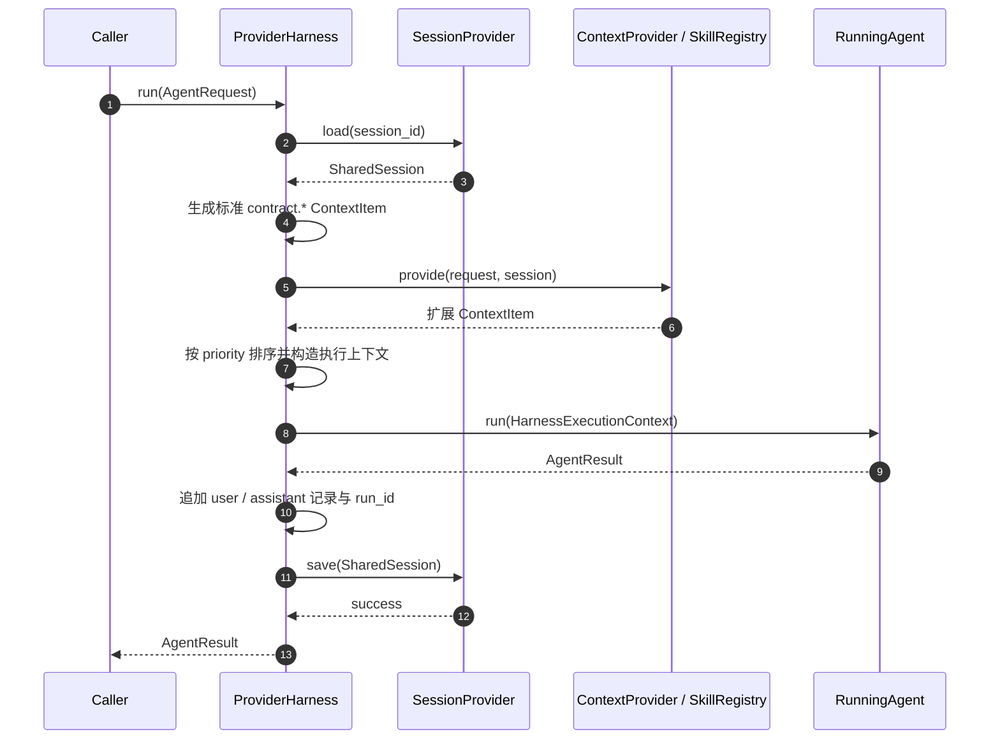

# 单 Agent Harness 契约的设计思路

## 1. 问题从哪里开始

一个 Agent 看起来像是很简单的函数：输入一段任务文本，调用模型，返回一段回答。若系统永远只使用一个模型 SDK、没有工具、没有多轮对话、没有跨进程调用，这个模型足够。

真实系统很快会超出这个前提。一个工作者可能由 AgentScope、LangGraph 或 OpenAI SDK 实现；它可能需要调用 MCP 工具，可能在某次调用中暂停等待人工审批，也可能需要在下一次调用时记住上轮已经确认的业务事实。上层编排器还会把任务分给不同工作者，并希望它们可以独立部署、替换实现或切换模型供应商。

此时，若上层直接依赖某个框架的 `Agent`、消息类型、记忆对象或 checkpoint，就会产生四种耦合：

1. **框架耦合**：编排器必须了解每个 Agent 的原生 API；更换一个 runtime 会波及任务分派和服务接口。
2. **状态耦合**：会话历史被保存为框架私有对象，切换 runtime 后无法恢复，甚至无法序列化。
3. **生命周期耦合**：加载会话、补充业务上下文、调用模型、记录结果等公共步骤会散落在每个 Agent 实现中。
4. **能力耦合**：配置写了工具或技能，并不代表选定 runtime 真能执行它；问题往往直到线上请求才暴露。

因此，单 Agent 的统一契约并不是要抽象“模型生成文本”本身。它要定义的是：**无论内部用什么框架，一个工作者完成一次业务调用时，对外必须遵守什么输入、状态、输出和生命周期规则。**



这张图隐含了第一条原则：上层只依赖稳定契约；框架对象只能存在于 adapter 一侧。

## 2. 先划清职责，而不是先设计类

设计统一契约时，最容易犯的错误是把所有需求塞进一个“大 Agent 接口”。更稳妥的做法是先问：一次调用中有哪些职责，它们会不会因框架而变化？

| 职责 | 是否依赖具体框架 | 应归属的位置 |
|---|---:|---|
| 角色、系统指令、可用工具、模型连接选择 | 否，属于业务声明 | `HarnessSpec` |
| 本轮任务、会话标识、恢复载荷、认证范围 | 否，属于调用事实 | `AgentRequest` |
| 长期事实与对话历史 | 否，必须跨框架保存 | `SharedSession` + `SessionProvider` |
| 租户规则、RAG 结果、协作快照、技能内容 | 否，但来源可变 | `ContextProvider` + `ContextItem` |
| 如何构造原生模型、工具箱、图 | 是 | `HarnessRuntimeAdapter.build()` |
| 如何把原生输入/输出翻译为契约 | 是 | `RunningAgent` |
| 会话恢复、上下文汇集、记账、保存 | 否，且每次都必须一致 | `ProviderHarness` |
| 跨网络传输、重试、HTTP 认证 | 否，但不属于单 Agent 生命周期 | A2A / deployment 层 |
| 选择哪些工作者、任务依赖、反思循环 | 否，但不属于单 Agent 生命周期 | orchestration 层 |

这里的关键判断是：**“调用模型”是可替换的，“围绕一次调用应该发生什么”是稳定的。**

所以本项目没有让 `ProviderHarness` 直接继承 AgentScope 或 LangGraph 类型，也没有让 adapter 管理共享会话。Harness 只负责稳定的生命周期；adapter 只负责框架翻译。两者之间的分界，就是 `HarnessExecutionContext` 和 `AgentResult`。

## 3. 从约束推导契约需要哪些数据

### 3.1 静态声明与动态状态必须分离

一个 Agent 的角色、允许使用的工具和模型服务配置通常在部署或注册时确定；用户任务、会话历史和协作结果则在每次调用中变化。若把两者混在同一个可变对象中，会产生两个问题：配置难以审计，运行状态也难以迁移。

因此契约分为两类数据：

- **静态声明 `HarnessSpec`**：回答“这个 Agent 是谁、可做什么、配置了什么”。
- **动态输入 `AgentRequest`、`SharedSession`、`ContextItem`**：回答“这次要做什么、已知什么、应该额外参考什么”。

`HarnessSpec` 包含 `AgentIdentity`、`instructions`、`requested_capabilities`、MCP 工具声明、Skill 声明与可选的 `LlmServingSpec`。这些字段全是纯数据，而非框架对象。这样同一份声明可以分别翻译为 AgentScope 的 `Agent`、LangGraph 的 ReAct 图或 OpenAI Chat Completions 请求。

`AgentRequest` 则至少需要以下稳定锚点：

| 字段 | 为什么不能省略 |
|---|---|
| `request_id` | 关联日志、远程运行记录、幂等与审计。 |
| `session_id` | 决定恢复哪一份跨请求业务状态。 |
| `input` | 用户或编排器给本次工作的直接指令。 |
| `metadata` | 容纳协作快照、幂等键、调用来源等可扩展但不应膨胀为一等字段的数据。 |
| `resume` | 表达“这是从某个中断点继续”，避免把人工审批恢复伪装成全新调用。 |
| `request_context` | 只传播已经认证的主体、租户、角色和 trace 信息，绝不携带原始凭据。 |

这项拆分保证：修改系统指令、工具白名单或模型网关，不会污染一份已经运行中的会话；恢复会话时，也不需要恢复某个框架的 Python 对象。

### 3.2 会话必须是中立的业务数据，而不是框架记忆

框架通常有自己的 memory、thread、checkpoint 或 message 类型。直接持久化它们会锁死实现：切换 runtime、升级 SDK 或改为远程执行时，旧状态都可能失效。

本项目使用 `SharedSession` 作为最小公共记忆：

```text
SharedSession
├── session_id
├── facts: {业务字段: 值}
├── messages: ["user: ...", "assistant: ..."]
└── runtime_references: {runtime_name: {run_id: ...}}
```

它只保存字符串、字典、列表和 ID 等可序列化数据，不保存框架对象、连接、token 或私有 checkpoint。这里不是否定框架原生记忆，而是规定它不能成为跨框架业务连续性的唯一来源。某个 adapter 可以使用本框架的短期记忆优化单次会话，但长期业务状态仍须能够从 `SharedSession` 重建。

### 3.3 上下文不是任意拼接的字符串

Agent 所需信息来自多个层次：本轮任务、流程协作结果、用户会话、租户政策、RAG 检索结果、技能说明。若每个 adapter 分别从请求对象或数据库里取这些数据，会让“同一个 Agent 换 runtime 后看见不同事实”。

因此，Harness 用 `ContextItem(label, content, priority)` 统一上下文单位：

- `label` 给内容一个可审计、可引用的来源名；
- `content` 是适配器可映射到 prompt、message 或 state 的文本；
- `priority` 规定稳定顺序，防止 Provider 注册顺序偶然改变模型输入。

Harness 无条件生成三条保留上下文：

| 标签 | 数据来源 | 解决的问题 |
|---|---|---|
| `contract.collaboration` | `request.metadata["collaboration"]` | 把工作流事实、当前任务输入、前序回执交给 Worker。 |
| `contract.session.facts` | `SharedSession.facts` | 让结构化业务事实跨请求继续存在。 |
| `contract.session.messages` | `SharedSession.messages` | 让对话连续性不依赖某个框架的消息对象。 |

调用方还可以实现 `ContextProvider` 追加租户规则或检索结果，但不应覆盖 `contract.*` 命名空间。这样，协作协议有确定所有权，扩展内容又不被限制在固定字段里。

### 3.4 工具和技能要被显式声明，并可在启动前验证

工具不是一段 prompt 描述，而是外部副作用边界。Skills 也不是无害的配置：技能正文可能来自文件或 MCP 服务，脚本更可能带来执行风险。因此统一契约必须表达：连接哪里、允许哪些工具、哪些被明确禁止、是否允许加载技能或执行技能脚本。

`McpServerSpec` 以中立字段描述传输、地址、headers、白名单、黑名单、超时和审批要求；`SkillSpec` 描述来源、内容或路径、关联 server、可用工具和脚本开关。抽象的目的不是承诺所有框架都支持所有能力，而是让 adapter 可以明确翻译、拒绝或降级。

这就引出 `Capability`：

```text
声明方：这个 Agent 请求 TOOL_LOOP / SKILLS / STRUCTURED_OUTPUT
实现方：这个 runtime 支持哪些 Capability
Harness：在运行前计算差集并报告不兼容组合
```

启动前失败优于在线上半途失败。例如，声明了 MCP tools 却选择不支持工具循环的基础 OpenAI runtime，应在 `validate()` 中报错；MCP 来源的 Skill 引用了不存在的 server，或其允许工具超出 server 白名单，也应在网络调用前发现。

## 4. 把“框架差异”关进一个窄接口

经过前面的拆分，真正需要依赖框架的部分只有两件事：构建原生 Agent，以及执行一次原生调用。于是 adapter 的公共面可以保持很小：

```python
class HarnessRuntimeAdapter(Protocol):
    runtime_name: str

    def capabilities(self) -> frozenset[Capability]: ...

    async def build(
        self, spec: HarnessSpec, providers: HarnessProviders
    ) -> RunningAgent: ...

    async def close(self) -> None: ...

class RunningAgent(Protocol):
    async def run(self, context: HarnessExecutionContext) -> AgentResult: ...
    def run_stream(self, context: HarnessExecutionContext) -> AsyncIterator[AgentResult]: ...
```

这组接口刻意没有暴露“原生消息类型”“模型客户端”“工具对象”或“框架状态”。`build()` 是唯一允许把 `HarnessSpec` 翻译为框架原生构造的地方；`run()` 是唯一要求 adapter 将完整 `context_items` 映射到原生 prompt、message 或 state 的地方。

以现有实现为例：

| Runtime | `build()` 的翻译 | `run()` 的映射 |
|---|---|---|
| 基础 OpenAI 兼容 | `HarnessSpec` + Serving -> Chat Completions 客户端调用参数 | `instructions` 作为 system，任务与所有 `ContextItem` 作为 user 内容。 |
| AgentScope | `HarnessSpec` -> 原生 `Agent(system_prompt=...)` | 任务与全部上下文构造成 `UserMsg`。 |
| AgentScope MCP | MCP 声明 -> `MCPClient` -> `Toolkit` -> 带 ReAct 的 Agent | 同上；工具确认和循环由 AgentScope 管理。 |
| LangGraph MCP | MCP 声明 -> 工具发现与过滤 -> `create_react_agent` | 任务与全部上下文作为 `HumanMessage` 输入图状态。 |
| OpenAI MCP | MCP 工具 schema -> Chat Completions function tools | 在模型消息、tool call 与 tool result 之间维护受预算限制的循环。 |

不同 runtime 的工具循环、流式事件和私有内存可以不同；它们对 Harness 的承诺不变：接收同一份执行上下文，产生同一形状的 `AgentResult`。

## 5. ProviderHarness：把稳定生命周期收敛到一个地方

有了数据契约和 adapter 接口，还需要一个不依赖 AI 框架的执行外壳。`ProviderHarness` 负责这个角色。它不是另一个 Agent，而是单个 Agent 每次运行的生命周期控制器。

一次 `run(request)` 的顺序是：



这八个步骤看似普通，但顺序本身是契约的一部分：

1. **先恢复会话**，再生成上下文，保证 Provider 能同时看到本轮请求和历史状态。
2. **先准备 Agent**，但通过懒加载只在首次真实调用时执行 `runtime.build()`；大量预装配 Worker 不会立即建连。
3. **先标准上下文，后扩展上下文**，最后统一排序；任何合规 runtime 得到相同输入集合。
4. **先得到 AgentResult，再进行会话记账**；失败调用不会写入伪造的 assistant 空回复。
5. **先保存，后返回**；持久化失败时，上层不会误以为一次未记录的执行已经成功。

结果记账固定为两类：`messages` 追加 `user: {input}` 与非空 `assistant: {output}`，`runtime_references` 记录当前 runtime 的 `run_id`。这使审计可追溯，又避免把原生运行状态泄漏到共享会话。

## 6. 处理 Skills 与不可信上下文

Skill 的设计体现了一个重要区分：Skill 是“告诉 Agent 如何完成任务的说明书”，不是天然可信的系统指令。

Harness 先注入 L1 技能目录，说明其来源和“不可信输入”边界；当 runtime 不具备原生 `SKILLS` 能力时，再把 L2 正文包装为带 `trust="untrusted"` 的上下文项降级注入。这样，基础 OpenAI runtime 仍可使用 Skill 内容，但模型收到的是明确标注来源的资料，而不是与系统指令同等地位的文本。

对于 `enable_scripts=True` 的 Skill，默认脚本策略拒绝执行；`strict_skills=True` 时，Harness 在运行前直接返回失败。这个设计将“模型可以阅读一段文字”和“宿主可以执行外部代码”分开，避免把 prompt 注入风险扩展为代码执行风险。

## 7. Harness 与 A2A、编排的边界

单 Agent Harness 必须能被上层复用，但不能承担上层职责。

### 7.1 A2A 是协议边界，不是 Harness 的一部分

`A2AWorkerService` 将 JSON 载荷翻译为 `AgentRequest`，调用本地 Harness，再将 `AgentResult` 归一为 `WorkerResult`。`A2AWorkerEndpoint` 做反向转换。这样 HTTP、内存 transport、认证头和序列化错误都停留在协议层；Harness 不需要知道任务来自本地函数还是远程网络。

A2A 传递的协作快照进入 `AgentRequest.metadata["collaboration"]`，由 Harness 统一转为 `contract.collaboration`。这个两段式转换避免 adapter 直接解析协议 payload，也避免 A2A 层直接拼模型 prompt。

### 7.2 编排负责分工，Harness 负责执行一份已分配任务

编排层根据 `WorkerDescriptor` 选择工作者、生成 `WorkerTask`、处理依赖和 REACT 反思循环。它只知道 Worker 的标识、能力、地址和描述，不持有 Harness 或框架对象。

在某张任务单真正执行前，编排层用 `build_collaboration_input()` 构造纯 JSON 协作快照：

```text
workflow_facts
+ task_input
+ prior_results
+ dependency_results
```

Harness 将其作为标准上下文注入。由此，编排层不会侵入 prompt 细节，Worker 也不需要知道自己被哪种工作流调度。

## 8. 当前契约如何满足最初的问题

将最初的四类耦合与当前设计对应，可以看到每一个抽象都有明确的消除对象：

| 最初风险 | 当前机制 | 得到的性质 |
|---|---|---|
| 上层依赖框架对象 | `Harness`、`RunningAgent`、`AgentResult` Protocol/数据类 | 可替换 runtime，调用方式不变。 |
| 状态被框架私有格式锁定 | `SharedSession` + `SessionProvider` | 跨请求、跨 runtime 的中立业务连续性。 |
| 共同生命周期散落 | `ProviderHarness.run()` | 上下文、记账与持久化规则一致、可审计。 |
| 配置与实现能力不匹配 | `Capability` + `validate()` | 在启动或注册阶段尽早失败。 |
| 工具过度授权 | `McpServerSpec` 白/黑名单、审批与超时 | adapter 可以按最小权限翻译工具集。 |
| 外部技能污染指令 | 来源标注、`trust="untrusted"`、脚本策略 | 将资料消费与代码执行分层治理。 |
| 协作信息随框架丢失 | 保留 `contract.*` ContextItem | 每个 runtime 得到相同协作和会话数据面。 |
| 远程协议渗透 Agent 实现 | A2A service/endpoint 转换层 | Harness 可本地运行，也可独立部署。 |

## 9. 设计中的取舍与后续演进点

这个契约有意保持克制，并不试图抹平所有框架差异。

- `run_stream()` 已在接口中保留，但部分 adapter 当前以一次完整结果适配流式协议。它定义了扩展方向，而不假装已经提供 token 级一致语义。
- `AgentResult.data` 提供结构化输出的中立出口，但 JSON schema、强类型校验和修复循环仍由具体业务或 adapter 扩展。
- `ContextItem` 目前以文本内容为核心，适合统一映射到主要 LLM runtime；未来若要支持图像、文件和引用片段，可在保持来源、优先级与可信边界不变的前提下扩展内容模型。
- `LlmServingSpec` 支持每个 Harness 使用独立模型服务，但密钥管理仍应由环境变量或 secret manager 承担，不能把明文配置带入 `AgentRequest`、`SharedSession` 或审计事件。
- 提示词配置已经在 `HarnessSpec.instructions` 与 `ContextProvider` 中有承载位置。若平台要开放员工级、模板级 prompt，需要增加持久化、权限、版本和优先级规则，而不是绕过 Harness 在某个 adapter 中临时拼接字符串。

一个合理的提示词层次可以是：平台不可覆盖的安全基线、租户规则、员工角色指令、流程模板规则、请求级业务上下文、用户任务和不可信外部资料。越靠前的规则越不应被后面的文本覆盖；外部资料应始终保留来源与不可信标识。

## 10. 使用这套契约时的检查清单

新增一个单 Agent runtime 或业务 Worker 时，可按以下顺序自检：

1. 是否能用 `HarnessSpec` 的纯数据表达身份、指令、工具、Skill 与 Serving，而不把框架对象泄漏到 `common`？
2. 是否让动态任务进入 `AgentRequest`，让长期业务状态进入 `SharedSession`，而不是写进 adapter 的私有成员？
3. 是否完整消费 `HarnessExecutionContext.context_items`，尤其是三个 `contract.*` 保留项？
4. 是否在 `build()` 中完成所有框架翻译，并在 `run()` 中归一化为 `AgentResult`？
5. `capabilities()` 是否如实声明工具循环、结构化输出、流式和 Skills 等实际支持度？
6. `validate()` 是否能在网络调用前发现工具、Skill 与 capability 的矛盾？
7. 是否将协议处理留给 A2A、任务选择留给 orchestration，而不向 Harness 注入这些职责？
8. 是否保证敏感凭据、框架对象和原生 checkpoint 不进入共享会话、请求 metadata 或日志？

满足这些条件，Harness 就不是某个 SDK 的包装器，而是一条稳定的单 Agent 执行边界。框架、模型、工具实现和部署方式都可以演进；上层仍然面对同一种工作者调用语义、同一份业务上下文和同一个可审计的结果形状。
