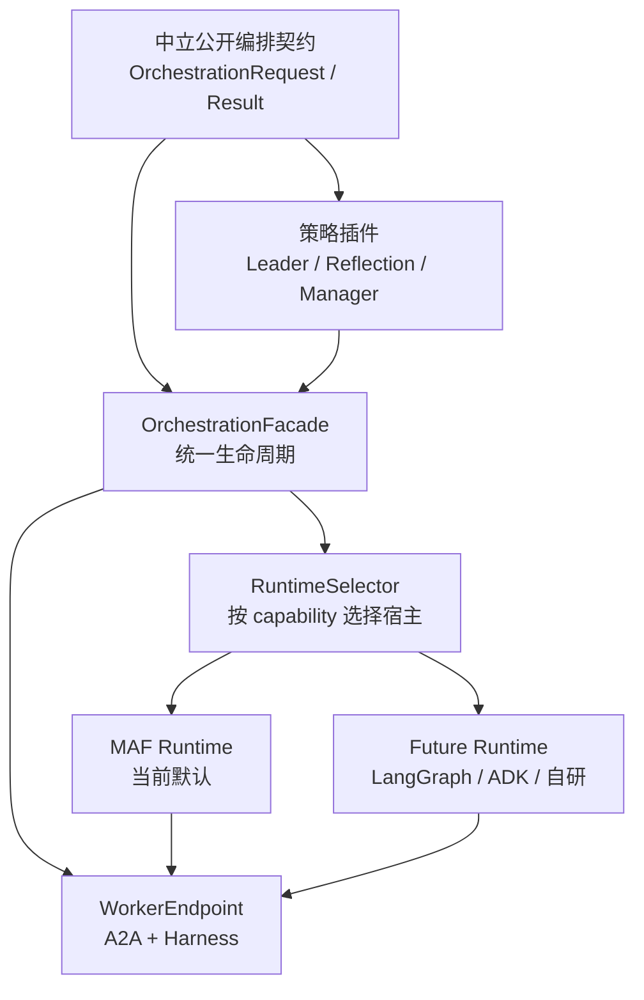

# 可替换 Orchestration Framework 的多 Agent 编排抽象 Proposal

## 1. 提案要解决什么问题

当前项目已经把 Worker 侧抽象为中立 Harness：不同 Agent 框架可以通过 runtime adapter 接入，并向上提供稳定的 `AgentRequest -> AgentResult` 语义。多 Agent 编排侧则选择 MAF 作为当前工作流宿主，利用其 Workflow 与 Magentic 能力完成顺序、并发、条件路由和动态 REACT。

这个选择在当前是合理的：MAF 已经覆盖项目需要的大部分编排机制，直接复用成熟运行时比重新实现图执行器更高效、更可靠。本 Proposal 不主张替换 MAF，也不主张立刻为抽象而抽象。

它讨论的是一个更具体的问题：**当未来确实需要同时支持第二个生产级编排宿主时，如何在不改变 Worker、A2A、Harness 与业务调用方的前提下，使多 Agent 编排框架可替换？**

触发这一抽象的合理信号包括：

1. 某类流程需要另一宿主独有且经过验证的能力，例如持久 checkpoint、人工中断恢复、特定云端编排服务或已有企业工作流基础设施。
2. MAF 与另一宿主都需要承载同一套 `OrchestrationRequest`、Worker 目录、任务回执、审批与审计语义。
3. 第二个实现不是 demo，而是至少有一个端到端生产场景和一致性测试。

没有这些信号时，新增一层 runtime abstraction 只会把 MAF 的 API 再包装一次，增加维护成本而不创造迁移能力。

## 2. 设计目标与非目标

### 2.1 目标

- 对调用方保持 `OrchestrationRequest -> OrchestrationResult` 的稳定入口。
- 对 Worker 保持 `WorkerEndpoint.execute(WorkerTask, session_id)` 的稳定执行边界。
- 允许不同 runtime 实现单轮流程与 REACT/动态协作，但不让框架类型泄漏到 `common/`。
- 保留当前的协作快照、任务 ID、幂等键、审批状态与审计语义。
- 根据流程所需能力选择 runtime，并在启动前拒绝无法满足的组合。
- 使 MAF 继续作为默认、成熟的实现，而不是降低到“最低公分母”。

### 2.2 非目标

- 不要求所有框架暴露完全相同的原生功能。
- 不尝试把所有框架的图、checkpoint、聊天历史或观测模型转换为同一种内部对象。
- 不允许 LLM 或 runtime 绕过 `WorkerEndpoint` 直接调用 Worker。
- 不把业务流程定义、租户权限、A2A transport 或单 Agent Harness 迁入 runtime adapter。
- 不在没有第二个真实 runtime 前提前实施完整抽象。

## 3. 核心判断：抽象“公开语义”，不抽象“框架图 API”

错误的方向是定义一套自制的 `Node`、`Edge`、`StateGraph`、`Participant` 和 `Checkpoint` API，再为 MAF、LangGraph、ADK 分别翻译。这样既会重复实现成熟框架，也会被最复杂框架的语义拖入无限兼容工作。

正确的抽象层次是业务编排的公开语义：请求、计划、任务、回执、轮次、终态和生命周期。当前 `common.contracts` 中已有这条数据面：

```text
OrchestrationRequest
        ↓
OrchestrationPlan / WorkerTask / collaboration snapshot
        ↓
WorkerEndpoint -> WorkerResult
        ↓
RoundRecord / OrchestrationResult
```

新 abstraction 应继续以此为中心。每个 runtime 可以用原生图、group chat、顺序/并行 agent 容器或云服务实现流程，但必须把输入和终态收敛为这些中立对象。



图源文件：[可替换编排框架抽象Proposal.mmd](可替换编排框架抽象Proposal.mmd)。

## 4. 建议的分层与职责

| 层次 | 保持或新增的抽象 | 负责什么 | 不负责什么 |
|---|---|---|---|
| 公共契约层 | `OrchestrationRequest`、`WorkerTask`、`WorkerResult`、`OrchestrationResult` | 跨 runtime 的业务输入、协作状态与终态 | 框架图对象与模型消息 |
| Worker 边界 | `WorkerDescriptor`、`WorkerEndpoint` | 发现能力、执行任务、返回规范化回执 | 决定流程走向 |
| 策略层 | `LeaderPolicy`、`ReflectionPolicy`，未来可增加受约束 manager 策略 | 任务拆解与再规划建议 | 直接调用 Worker 或修改图状态 |
| 编排门面层 | 建议新增 `OrchestrationFacade` | 选择 runtime、验证能力、启动、恢复、统一终态 | 实现某一框架的图 |
| Runtime SPI | 建议新增 `OrchestrationRuntime` | 将中立语义映射为框架原生执行 | 暴露框架对象给上层 |
| Runtime 实现 | `MafOrchestrationRuntime`、未来实现 | MAF/LangGraph/ADK 等原生装配与运行 | 改写公共契约 |

`OrchestrationFacade` 是未来调用方的唯一入口。它应负责 request 校验、runtime 选择、生命周期与审计边界；`OrchestrationRuntime` 只负责把一份已验证的中立执行描述跑起来。

## 5. 最小 Runtime SPI

建议避免直接暴露通用图对象，而以“构建、运行、恢复、关闭”作为最小协议：

```python
class OrchestrationRuntime(Protocol):
    runtime_name: str

    def capabilities(self) -> frozenset[OrchestrationCapability]: ...

    async def validate(
        self,
        definition: OrchestrationDefinition,
        workers: Sequence[WorkerEndpoint],
    ) -> Sequence[str]: ...

    async def start(
        self,
        definition: OrchestrationDefinition,
        request: OrchestrationRequest,
        workers: Sequence[WorkerEndpoint],
    ) -> RunningOrchestration: ...

    async def close(self) -> None: ...

class RunningOrchestration(Protocol):
    async def run(self) -> OrchestrationResult: ...
    async def resume(self, input: ResumeInput) -> OrchestrationResult: ...
    async def cancel(self) -> None: ...
```

其中 `OrchestrationDefinition` 不等于框架图。它应是中立的、版本化的流程声明，至少包含：模式、完成规则、预算、策略引用、允许的 Worker 集合、审批/恢复规则和必要的业务配置。第一阶段可以从现有 `create_workflow()` 参数与 `ProcessTemplate` 快照逐步提炼，而不是一次重写所有流程定义。

`RunningOrchestration` 不返回 runtime 原生 event stream。若需要流式观测，应定义中立的 `OrchestrationEvent`，例如 `planned`、`task_started`、`task_completed`、`approval_required`、`replanned`、`completed`、`failed`。MFA、LangGraph 或其他宿主的细粒度事件可在 adapter 内转换或作为诊断属性保留，不应成为业务 API 依赖。

## 6. 能力模型：避免最低公分母

Harness 使用 `Capability` 避免“声明需要工具循环、runtime 却不支持”的配置错误。编排 runtime 同样需要能力声明，但其语义应面向工作流，而不是面向框架名：

| `OrchestrationCapability` 候选项 | 含义 | 典型用途 |
|---|---|---|
| `SEQUENTIAL_DISPATCH` | 有序执行与依赖检查 | 普通串行、接力流程 |
| `CONCURRENT_DISPATCH` | 并发扇出/汇聚 | 独立检索、并行审查 |
| `CONDITIONAL_ROUTING` | 基于结果选择后继 | 审批、失败分支 |
| `ITERATIVE_REPLANNING` | 可根据回执追加任务 | builtin REACT、Magentic |
| `DYNAMIC_PARTICIPANTS` | manager 动态选择下一位 Worker | group-chat/Magentic 类流程 |
| `DURABLE_CHECKPOINT` | 可跨进程恢复的执行状态 | 长流程、人工审批 |
| `HUMAN_APPROVAL` | 原生暂停与恢复语义 | 受控副作用 |
| `STREAMING_EVENTS` | 统一事件流 | 前端实时轨迹 |
| `COMPENSATION` | 显式补偿事务 | 支付、资源创建等副作用 |

能力模型不要求所有 runtime 都实现所有项。`MafOrchestrationRuntime` 可声明当前 MAF 实际能够可靠承诺的集合；未来 LangGraph runtime 可以额外声明 durable checkpoint。流程定义请求某项能力时，Facade 在运行前做差集验证。

这比把所有 runtime 降级到“只会顺序调用 Worker”更重要：可替换不应牺牲 MAF 已经提供的高级能力。

## 7. 运行语义必须保持哪些不变量

可替换 runtime 的真正难点不在创建对象，而在保证不同宿主不会改变业务含义。至少应锁定以下不变量：

1. **Worker 白名单**：计划或 manager 只能选择已注册 `WorkerEndpoint`；未知 Worker 必须成为结构化失败，而不是隐式网络调用。
2. **协作快照形状**：所有 runtime 调用 Worker 前都必须使用 `build_collaboration_input()`，保留 `workflow_facts`、`task_input`、`prior_results`、`dependency_results`。
3. **依赖与并发语义**：并发任务不观察彼此中间结果；显式依赖任务只在上游成功后解锁。
4. **幂等语义**：同一恢复意图复用同一 `idempotency_key`；新的任务或再规划任务生成新键。
5. **终态优先级**：`needs_approval`、`failed`、`completed` 的判定规则需要明确且一致，不能仅按框架是否抛异常决定。
6. **预算与治理**：循环轮数、任务数量、停滞阈值、高危能力限制必须在框架外有可审计配置，不能只写进 manager prompt。
7. **状态所有权**：runtime 原生 checkpoint 属于 runtime；跨框架审计与业务连续性仍使用中立记录、协作快照与 Harness `SharedSession`。

这些不变量应写成跨 runtime 的契约测试，而不是仅用 MAF 的集成测试间接覆盖。

## 8. MAF Runtime 如何映射到该 Proposal

引入 SPI 后，当前实现不是废弃重写，而是收敛为第一个 runtime：

| 当前实现 | 未来位置 | 保留方式 |
|---|---|---|
| `create_workflow()` | `MafOrchestrationRuntime.start()` 内部 | 按 request mode 构造单轮或 REACT workflow |
| `PlanExecutor`、`DispatchExecutor`、`AggregateExecutor` | MAF 单轮流程实现 | 保持现有确定性节点语义 |
| `create_react_workflow(engine="builtin")` | MAF runtime 的受控 REACT 实现 | 用于可编码反思规则和离线验证 |
| `create_react_workflow(engine="magentic")` | MAF runtime 的动态 REACT 实现 | 继续复用 MagenticBuilder 与 manager |
| `ReactOrchestration.finalize()` | runtime 到中立结果的适配器 | 统一 builtin/Magentic 的输出形状 |
| `MagenticWorkerAdapter` | MAF 特有 Worker 翻译层 | 保留 participant <-> WorkerEndpoint 转换 |

这说明可替换设计并不否定当前 MAF 选择。相反，它将已有 MAF 特定代码收敛到清晰实现边界，令上层流程、Worker、Harness 与审计系统不必随着第二个 runtime 出现而重写。

## 9. 第二个 Runtime 的接入路径

以未来接入 LangGraph、Google ADK 或企业内部工作流引擎为例，建议按渐进路径推进：

1. **冻结现有中立语义**：为模式、协作快照、审批、失败、终态和 REACT 预算补充契约测试。
2. **抽取 Facade，但仍只注册 MAF**：不改变默认行为；Facade 只是接管现有 `create_workflow()` 的调用点。
3. **提炼 `OrchestrationDefinition`**：从当前模板快照和工厂参数中抽出最小、版本化流程声明，避免携带 MAF 类型。
4. **实现第二个 runtime 的最小切片**：先支持一个单轮顺序或并发场景，不急于支持所有 REACT 特性。
5. **运行同一套契约测试**：验证 Worker 目录、协作快照、依赖、失败聚合和审计结果与 MAF 一致。
6. **按能力开放选择**：只有在 `capabilities()` 满足流程需求时，允许租户/模板/部署配置选择新 runtime。
7. **最后再迁移复杂能力**：例如持久 checkpoint 或动态 participant；每项能力单独定义降级、拒绝和审计策略。

运行时选择不应由用户任意传入一个字符串决定。建议由平台的已审核流程模板或部署配置指定 `runtime_name`，Facade 再依据流程所需能力验证；这样可避免租户绕过高风险流程的既定治理。

## 10. 何时不应抽象

以下情况应继续直接使用当前 MAF 代码，而不是启动本 Proposal：

- 只有“理论上可能支持第二框架”，但没有明确业务、性能、部署或合规需求。
- 第二框架只用于某个 demo，且不能覆盖同一 Worker 与审计语义。
- 为了支持某个框架的特殊 API，而准备把它的消息、图对象或 checkpoint 塞入 `common.contracts`。
- 为了追求统一而削弱 MAF 的动态 REACT、ledger 或治理能力。
- 无法为第二个 runtime 提供跨 runtime 的契约测试。

可替换性是一项迁移能力，不是把每个依赖都包一层的习惯。只有当两个真实实现共享稳定业务语义、却在执行机制上存在不可忽略差异时，runtime SPI 才值得引入。

## 11. 决策摘要与下一步

本 Proposal 建议：

- 继续将 MAF 作为默认且成熟的多 Agent 编排宿主；
- 不重造图执行器，也不在当前立即实现通用 runtime adapter；
- 先将当前公开数据面与跨 runtime 不变量明确为测试契约；
- 当第二个生产级运行时出现时，引入轻量 `OrchestrationFacade + OrchestrationRuntime + RunningOrchestration` SPI；
- 让 MAF 成为该 SPI 的第一个实现，并保留其高级能力；
- 以能力声明和受控模板选择 runtime，而不是将框架选择暴露为无约束用户输入。

这条路径既尊重当前 MAF 选型的工程价值，也为未来需要 LangGraph、Google ADK 或内部编排平台时保留了可验证、可迁移的边界。
