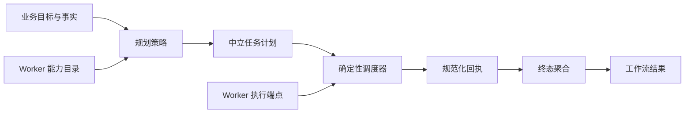
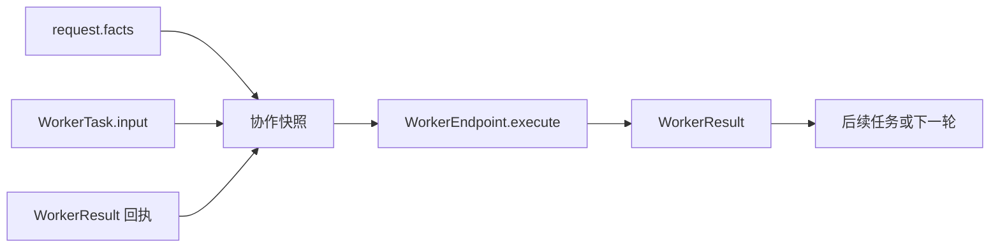
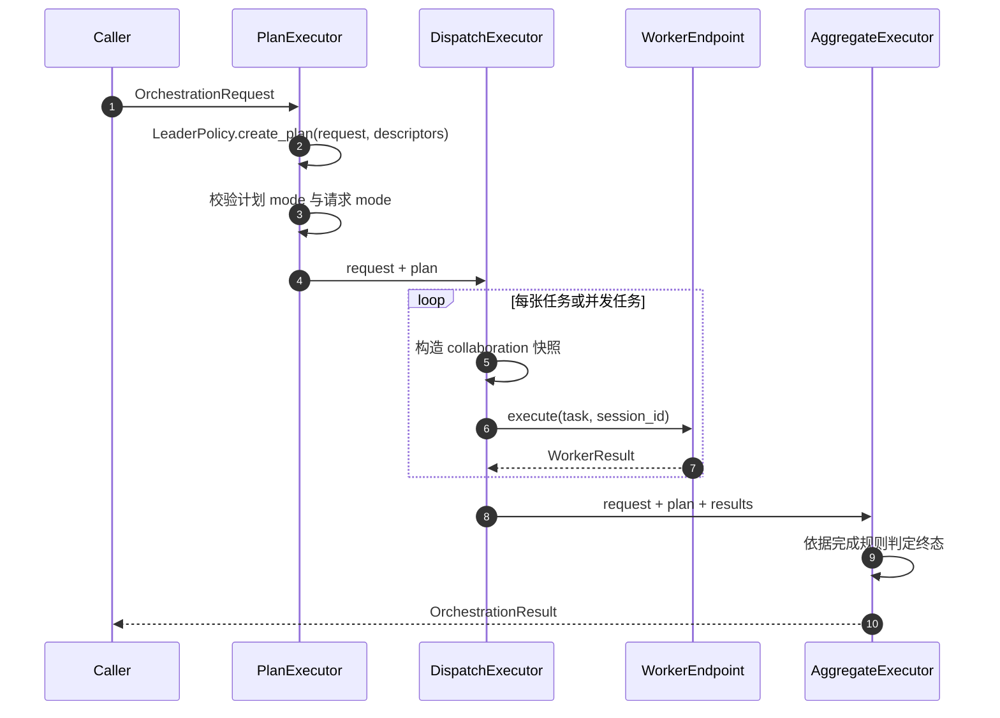
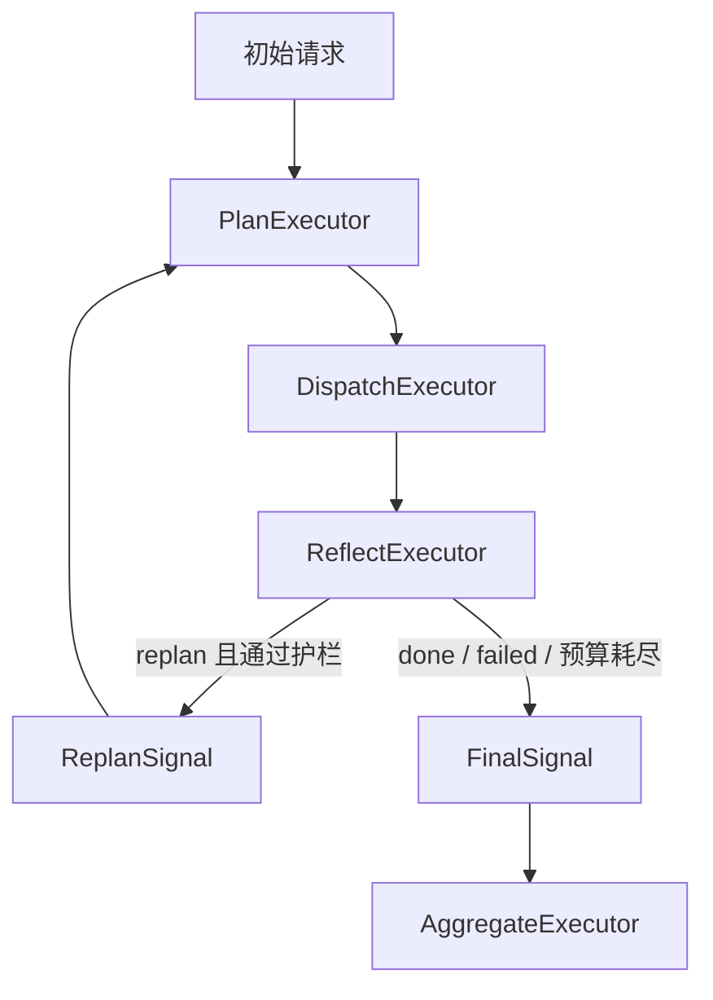

# 多 Agent Orchestration 契约设计思路

## 1. 问题从哪里开始

有多个 Agent 并不自动等于有多 Agent 协作。把几个模型调用按固定顺序连接起来，只能处理预先写死的流程；一旦出现“根据当前目标选择合适专家”“等待上游结果后再决定下一步”“部分任务失败后如何给出可审计结论”“需要再做一轮核验还是应当结束”等问题，系统就需要一层专门的编排抽象。

最朴素的实现往往把这些判断写进某个 Agent 的 prompt 或业务脚本：主管模型看到 Worker 的真实对象，直接调用它们，结果再被下一个模型读入。这会很快出现几个根本问题：

1. **执行权与决策权混在一起**：负责规划的模型同时拥有网络调用或工具权限，越过既定的 Worker 治理边界。
2. **Worker 实现泄漏到流程**：编排逻辑知道 AgentScope、LangGraph 或某个 HTTP 客户端的细节，Worker 难以独立部署或替换。
3. **协作信息变成不可审计的 prompt 文本**：前序结果被随意拼接，后续任务无法可靠区分原始事实、当前任务私有输入和上游回执。
4. **失败与暂停被异常吞掉**：网络错误、业务失败、人工审批等待混在异常处理里，调用方得不到清晰的工作流终态。
5. **REACT 循环失去边界**：让 LLM 自己决定何时停止，容易出现空转、无限加任务或反复调用高风险 Worker。

因此，多 Agent Orchestration 的核心不是“让一个模型管理多个模型”，而是定义：**如何把业务目标转换为可审计任务单，如何在受控目录中执行这些任务，以及如何把多次回执收敛为稳定的业务终态。**



这张图揭示了第一条设计原则：**策略可以不确定，执行与治理必须确定。**规划器可以是规则、LLM 或人工预设；但它产出的计划仍必须由确定性调度器验证和执行。

## 2. 先划清职责，而不是先选择编排框架

在设计工作流前，应先区分哪些变化属于业务策略，哪些规则必须始终稳定。否则很容易把任务分派、网络协议、Worker 内部推理和终态判定塞进同一段代码。

| 职责 | 是否应由 LLM 决定 | 当前归属 |
|---|---:|---|
| 目标应拆为哪些任务、选哪类 Worker | 可以 | `LeaderPolicy` / Magentic manager |
| 下一轮是否需要补充或修订任务 | 可以 | `ReflectionPolicy` / Magentic manager |
| 任务是否只能发给注册 Worker | 不可以 | `DispatchExecutor` / Magentic 装配护栏 |
| 任务依赖是否已满足 | 不可以 | `DispatchExecutor` |
| 本轮任务数量、REACT 轮数、停滞次数 | 不可以 | `ReflectExecutor` 或 MagenticBuilder 参数 |
| 如何调用远端 Worker | 不可以，但可替换协议实现 | `WorkerEndpoint` / A2A |
| Worker 如何调用模型、工具和保存会话 | 不属于编排 | 单 Agent Harness |
| 全部回执如何归并为完成、失败或待审批 | 不可以 | `AggregateExecutor` / `finalize()` |

由此得到三个清晰边界：

- **Harness** 解决“一个 Worker 如何可靠执行一次任务”；
- **A2A** 解决“任务如何跨进程、跨网络送达一个 Worker”；
- **Orchestration** 解决“多个 Worker 应做什么、以什么顺序做、怎样收敛结果”。

编排层不应构造框架原生 Agent，也不应直接拼 Worker 的系统提示词。它只处理中立目标、能力目录、任务、回执和工作流状态。

### 2.1 为什么选择 MAF 作为编排宿主

本项目并非认为 MAF 是唯一能做多 Agent 协作的框架。AgentScope、Google ADK、OpenAI Agents SDK、DeepAgents 等框架都能覆盖顺序委派、子 Agent、工具调用或部分循环式协作；LangGraph 也提供了很强的状态图能力。

选择 MAF 的原因是：项目需要的不只是“能调用多个 Agent”，而是一个成熟的**编排运行时**。MAF 同时提供 Workflow 图、类型化 Executor/handler、条件边、并发、回边和流式运行机制；其 Magentic 编排器还提供 manager/participant 模型、progress ledger、轮数/停滞/重置预算等动态 REACT 所需的基础设施。这些能力若由项目自行实现，需要重新解决消息路由、图状态、循环终止、并发调度、流式事件和可观测性等问题，成本高且难以获得同等成熟度。

因此，项目的选择与单 Agent Harness 的定位是对称的：

```text
单 Agent：复用 AgentScope、LangGraph、OpenAI 等框架的原生推理、工具和 ReAct 能力；
           Harness 统一请求、会话、上下文与结果边界。

多 Agent：复用 MAF 的原生工作流与动态编排能力；
           UniversalContract 统一 Worker、A2A、协作快照、权限与审计边界。
```

Harness 没有自行实现单 Agent ReAct；它把原生能力保留给运行时 adapter。同样，编排层不尝试重写一个通用工作流引擎，而是让 MAF 承担图执行与 Magentic 循环。项目自己的增量价值在于把异构 Harness Worker 接入同一编排数据面，并在 MAF 外侧补上中立任务、回执、协作状态与治理规则。

`engine="builtin"` 的 REACT 实现不意在替代 MAF。它是确定性参考实现：用于离线测试 `OrchestrationRequest`、`WorkerEndpoint`、协作快照、反思护栏和终态收敛这些公开语义，并支持“反思规则本身可以被明确编码”的受控流程。动态多 Agent 编排的生产默认引擎仍是 MAF Magentic。

当前没有再抽象一个类似 `HarnessRuntimeAdapter` 的通用编排 runtime 接口，原因也在这里：MAF 已覆盖当前需要的通用编排运行时能力，而项目尚未有第二个生产级编排宿主来验证该抽象。过早引入只会增加一层未被真实差异驱动的转发代码。公开的 `OrchestrationRequest`、`LeaderPolicy`、`ReflectionPolicy`、`WorkerEndpoint` 和 `OrchestrationResult` 已经保留了未来接入另一编排宿主所需的稳定边界。

## 3. 从协作约束推导核心数据契约

### 3.1 工作流入口必须同时表达目标、事实和协作语义

`OrchestrationRequest` 是一次业务事务的入口：

```text
OrchestrationRequest
├── workflow_id    工作流唯一标识
├── session_id     与 Worker 共享的长期会话标识
├── goal           自然语言业务目标
├── facts          初始结构化业务事实
└── mode           期望的编排语义
```

这里的 `goal` 适合交给策略解释，`facts` 适合确定性程序和所有 Worker 共同消费。两者不能混为一段 prompt：订单号、金额、租户范围等结构化事实必须可合并、可审计、可被下游任务精确引用。

`mode` 表示协作语义，而不是框架实现。例如 `HANDOFF` 说明任务有显式数据依赖，`CONCURRENT` 说明任务独立并行，`REACT` 说明工作流允许在结果出现后再规划。调用方只声明想要的业务语义，不需要知道内部采用 Microsoft Agent Framework 的图还是 Magentic。

### 3.2 给规划器看“能力目录”，不给它“执行对象”

规划策略接收 `WorkerDescriptor`，而不是 `WorkerEndpoint`：

```text
WorkerDescriptor
├── worker_id
├── endpoint
├── capabilities
└── description
```

它是一张能力卡片：稳定 ID 用于分派，能力标签和描述帮助选人，地址则用于运行时定位。尽管含有 endpoint 字符串，策略接口没有获得能够发起调用的对象；真正的执行能力只保留在 `DispatchExecutor` 所持有的 `WorkerEndpoint` 中。

这种分离不是为了形式上的解耦，而是治理边界。LLM 即使生成了计划，也只能提出 `worker_id`；调度器仍会按已注册目录查找 endpoint。选择目录外 Worker 时不会产生一次隐蔽网络调用，而会得到可审计的 `WorkerResult(status="failed")`。

### 3.3 计划要是数据，不是控制流

`OrchestrationPlan` 将策略选择转为可检查、可持久化的数据：计划 ID、编排模式、任务序列、完成规则、轮次和父计划 ID。计划中每个 `WorkerTask` 则明确：

| 字段 | 解决的协作问题 |
|---|---|
| `task_id` | 让一次工作单元可定位、可关联回执和审计事件。 |
| `worker_id` | 声明目标 Worker，交给调度器从注册目录解析。 |
| `instruction` | 给 Worker 的自然语言任务说明。 |
| `input` | 当前任务的结构化私有输入；调度前会包装为协作快照。 |
| `idempotency_key` | 重试、恢复时避免重复执行业务副作用。 |
| `depends_on` | 明确数据依赖，而不是依赖数组中的偶然顺序。 |
| `resume` | 使审批后的继续执行成为显式协议，而非新建一张任务。 |

一旦计划数据化，就能在执行前做一致性检查，记录每一轮决策，并用不同的 Leader 实现同一套调度语义。LLM 的自由度被限制在“提出计划”，可靠性规则仍由代码掌握。

### 3.4 回执必须把失败也当作数据

`WorkerResult` 统一表达 `completed`、`failed`、`needs_approval` 和 `cancelled`。这比“出错就抛异常”更适合工作流：一项任务失败时，其余结果、错误说明和远端运行 ID 仍应进入聚合器和审计记录。

`OrchestrationResult` 则是调用方唯一需要处理的终态，包含人类可读的 `summary`、机器可追溯的 `worker_results`，以及 REACT 时的完整 `rounds`。系统把底层的不确定性收敛成三种业务状态：`completed`、`failed`、`needs_approval`。

## 4. 协作快照：不把任务间通信退化为字符串拼接

多 Agent 协作中，当前任务必须知道哪些是原始事实、哪些是自己的输入、哪些是上游结果。若只把“前面 Agent 的回答”接在下一段 prompt 后，后续 Agent 无法可靠判断来源、状态或依赖关系，也难以在更换 runtime 后保持一致。

因此，`build_collaboration_input()` 将调度信息构造为固定结构：

```text
collaboration
├── workflow_facts       当前工作流事实
├── task_input           当前任务原始 input
├── prior_results        本任务前所有已完成回执
└── dependency_results   prior_results 中的显式依赖回执
```



调度器在调用 endpoint 前用该快照替换任务的 `input`。A2A 再把它传入 `AgentRequest.metadata["collaboration"]`，ProviderHarness 将其作为 `contract.collaboration` 上下文提供给底层 Agent。于是：

- Orchestration 不需要知道某个 runtime 如何拼 prompt；
- Harness 不需要理解任务依赖或工作流图；
- Worker 可以从统一位置读取协作事实；
- 框架切换不会改变同一任务看见的数据形状。

协作快照与 `SharedSession` 不能混淆。前者是当前工作流内、任务之间即时传递的短期数据面；后者是 Harness 管理的跨请求业务记忆。并发任务共享启动时的 `workflow_facts`，但不承诺能看见彼此尚未完成的回执，这正是 `CONCURRENT` 的语义。

## 5. 把模式语义和执行机制分开

`OrchestrationMode` 描述业务协作方式；`DispatchExecutor` 负责将其落实为稳定执行规则。

| 模式 | 业务含义 | 调度与可见性 |
|---|---|---|
| `LEADER_WORKER` | Leader 拆分并委派 | 按计划顺序执行，后续任务可看见已完成回执。 |
| `SEQUENTIAL` | 步骤顺序推进 | 每项启动前检查 `depends_on`，成功才解锁下游。 |
| `CONCURRENT` | 多项工作互不依赖 | `asyncio.gather` 并发执行，所有任务只看初始事实。 |
| `HANDOFF` | 上游产出驱动下游 | 通过 `depends_on` 和 `dependency_results` 明确传递。 |
| `REACT` | 执行后观察，再决定下一步 | 每轮产生记录，进入反思或 manager 的再规划循环。 |

这里有一个重要取舍：`SEQUENTIAL` 和 `HANDOFF` 在调度器中都按顺序运行，区别不在“是否使用 for 循环”，而在计划是否声明了可审计的数据依赖。不能只凭任务数组顺序暗示依赖，否则恢复、重试和可视化时无法判断谁真正依赖谁。

`completion_rule` 进一步定义单轮成功标准：`all` 要求所有任务完成，失败会短路后续无意义任务；`any` 允许某项成功即满足目标。无论哪种规则，`needs_approval` 都优先于失败和完成，因为流程在该状态下尚未可以安全收敛。

## 6. 一次单轮编排如何完成

单轮编排的图很小，但每个节点都有明确职责：



当前实现对应如下：

1. `PlanExecutor` 只把 `WorkerDescriptor` 列表交给 `LeaderPolicy`，并校验返回的 `plan.mode` 与用户声明的 `request.mode` 一致，避免策略把串行请求悄悄变成并行请求。
2. `DispatchExecutor` 保存 `worker_id -> WorkerEndpoint` 注册表。对于并发模式，它以相同的初始事实快照并发执行；其他模式逐项检查依赖、累积成功集合和回执。
3. 未注册 Worker、远端失败或审批等待都归一为 `WorkerResult`，而不是把控制流抛出工作流。
4. `AggregateExecutor` 统一计算业务终态，摘要优先取各 Worker 的文本输出，回执则完整保留。

这使策略、执行、结果判定可以分别替换或测试。离线 `DeterministicLeader` 能生成确定性计划，OpenAI 兼容 Leader 则能根据目标、事实和能力目录生成 JSON 计划；它们都不能改变调度器的依赖、目录和终态规则。

## 7. REACT：允许再规划，但不把控制权交给循环

有些目标无法在第一轮计划时拆清楚。例如先查询天气与 POI，才能确定出行日期；之后才可查询那一天的航班。REACT 的语义是：执行一轮，观察可审计结果，根据结果追加新任务或结束。

如果反思器可以无限制地自我决定，循环就会成为风险点。因此本项目把 REACT 拆成两层：

- **策略层**：`ReflectionPolicy` 或 Magentic manager 负责提出“继续、结束、失败”的业务建议；
- **护栏层**：确定性代码负责最大轮数、每轮任务数、空转和参与者白名单等不可协商限制。

### 7.1 builtin 引擎：可审计的回边图

builtin REACT 由 `PlanExecutor -> DispatchExecutor -> ReflectExecutor` 构成。`ReflectExecutor` 每轮先固化 `RoundRecord`，再把完整历史交给 `ReflectionPolicy`。



反思输出被视作提案，必须通过以下检查：

1. 下一轮不能超过 `max_rounds`；
2. 声称要 `replan` 时必须提供至少一个新任务，防止空转；
3. 新任务数量不能超过 `max_tasks_per_round`；
4. 反思得到的 `next_facts` 以不可变方式合并进下一轮 `request.facts`；
5. 所有轮次保留在 `RoundRecord` 中，供最终结果和审计使用。

这使 LLM 或规则反思器可以有业务判断能力，却不能绕过预算和控制流。

### 7.2 Magentic 引擎：复用框架循环，不改变公开契约

Magentic 更适合由 manager 动态选择下一位 participant、观察 chat history 和 progress ledger 的场景。但它的 participant 是 MAF `Agent`，终局产物也是 manager 的文本，不能直接暴露为项目的公共 API。

`MagenticWorkerAdapter` 因而承担翻译职责：

```text
Magentic participant instruction
        ↓
WorkerTask + idempotency_key
        ↓
build_collaboration_input()
        ↓
WorkerEndpoint.execute()
        ↓
WorkerResult
        ↓
participant 发言文本 + adapter 回执记录
```

`build_magentic_workflow()` 在装配前做确定性治理：participant 只能来自已注册的 `WorkerEndpoint`；声明 `write`、`payment`、`refund-submit` 或 `account-change` 等高危能力的 Worker 会被拒绝注册。主业务副作用应放在明确、可审批的 Workflow 节点中，而不是由开放式群聊编排触发。

MagenticBuilder 接收最大轮数、最大停滞次数和最大重置次数；manager 可以是确定性的 `MagenticManagerBase` 子类，也可以是由 LLM 驱动的 manager agent。无论内部选择如何，所有 participant 共用的仍是中立 `workflow_facts` 和 `WorkerResult` 列表，而不是 MAF 对象。

### 7.3 统一两种引擎的生命周期与结果

builtin 的 `workflow.run()` 已经输出 `OrchestrationResult`；Magentic 输出的是 manager 的终局文本，真实 Worker 回执保存在 adapter 中。`ReactOrchestration` 提供统一句柄：

- `reset()` 清空 builtin 的反思历史或 Magentic adapters 的轮次与回执；同一个工作流实例复用前必须调用它。
- `finalize()` 对 builtin 直接取终态输出；对 Magentic 调用 `collect_magentic_result()`，把终局文本、适配器收集的回执和近似轮次重新组装为 `OrchestrationResult`。

因此 `REACT` 作为契约 mode 只有一个含义，而 `engine="builtin"` 与 `engine="magentic"` 是可替换的实现细节。

## 8. 当前实现如何对应最初的设计问题

| 最初风险 | 当前机制 | 得到的性质 |
|---|---|---|
| 主管模型直接调用 Worker | `LeaderPolicy` 只接收 `WorkerDescriptor`；执行只发生在 `DispatchExecutor` | 分派建议与执行权限隔离。 |
| Worker 框架绑死流程 | `WorkerEndpoint.execute(task, session_id)` | Worker 可经 A2A 远程调用或更换 Harness runtime。 |
| 结果靠 prompt 拼接传递 | `build_collaboration_input()` + `contract.collaboration` | 上游回执有固定结构、来源和状态。 |
| 失败导致全流程异常中断 | `WorkerResult` 与 `AggregateExecutor` | 部分失败仍可得到可审计终态。 |
| 计划漂移或依赖失真 | `plan.mode` 校验、`depends_on`、已完成集合 | 请求语义与执行语义一致。 |
| REACT 无限循环或空转 | `ReflectExecutor` 轮数/任务数/空任务护栏；MagenticBuilder 预算 | 再规划受到硬上限约束。 |
| 动态群聊触发写操作 | Magentic 高危 capability 注册拒绝 | 副作用回到显式、可审批的节点。 |
| 两种 REACT 引擎暴露不同结果 | `ReactOrchestration.finalize()` | 调用方始终得到 `OrchestrationResult`。 |

## 9. 设计中的取舍与后续演进点

这套抽象追求的是稳定边界，而不是消除所有差异。

- `WorkerDescriptor.endpoint` 是目录信息，不是执行能力；策略接口仍不应接触 transport 或认证凭据。
- `OrchestrationPlan` 能表达任务、依赖与完成规则，但复杂的条件分支、补偿事务或长事务 Saga 仍应作为显式 Workflow 节点扩展，不能隐含在自然语言 instruction 中。
- builtin REACT 的 `RoundRecord` 是完整计划-执行历史；Magentic 的轮次目前根据 participant 回执近似构造，因为 MAF manager 的动态对话并不天然生成静态 `OrchestrationPlan`。若审计要求进一步提高，应增加 manager ledger 到中立 `RoundRecord` 的正式映射。
- `idempotency_key` 已进入任务和 A2A 载荷；要真正获得端到端幂等，外部 Worker 与有副作用的业务系统还必须持久化并校验该键。
- 并发 Worker 共用 `session_id` 时，长期 `SharedSession` 的存储实现需要原子保存或乐观并发控制；协作快照不能被错误地当作共享可变内存。
- 当前聚合摘要是确定性的文本拼接。需要高质量最终报告时，可在聚合后增加一个受限的 summarizer，但它应读取规范化回执，而不是重做 Worker 调度。

## 10. 使用这套编排契约时的检查清单

新增一个编排模式、规划策略或 Worker 组时，可按以下顺序检查：

1. 目标、事实、会话 ID 与协作模式是否都在 `OrchestrationRequest` 中明确表达？
2. 规划器是否只读取 `WorkerDescriptor`，而没有得到 `WorkerEndpoint`、transport 或框架对象？
3. 计划是否为可审计的 `OrchestrationPlan`，每项任务是否具备稳定 ID、幂等键、明确 instruction 与依赖？
4. 是否由调度器统一构造协作快照，而不是在 Leader、A2A 或 runtime adapter 中自行拼接前序结果？
5. 并发任务是否真的无数据依赖；需要消费上游产出时，是否改用显式 `depends_on` 的顺序语义？
6. Worker 失败、取消与待审批是否都保留为 `WorkerResult`，并由聚合逻辑统一处理？
7. 若使用 REACT，是否同时定义策略自由度和轮数、任务数、停滞、空转等确定性预算？
8. 若使用 Magentic，是否限制 participant 白名单并将写操作、高风险能力留在显式受控节点？
9. 是否在复用 REACT workflow 实例前调用 `reset()`，并在所有引擎下通过 `finalize()` 获得统一公开结果？
10. 是否让 A2A 负责远程传输、Harness 负责单 Agent 执行、Orchestration 负责协作决策，避免任一层侵入另一层职责？

满足这些条件后，编排层就不再是某个框架的多 Agent 包装器，而是一套可替换策略、可独立部署 Worker、可审计协作过程、可约束动态循环的工作流契约。
