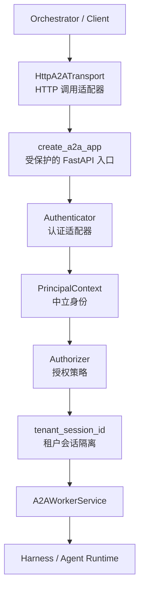
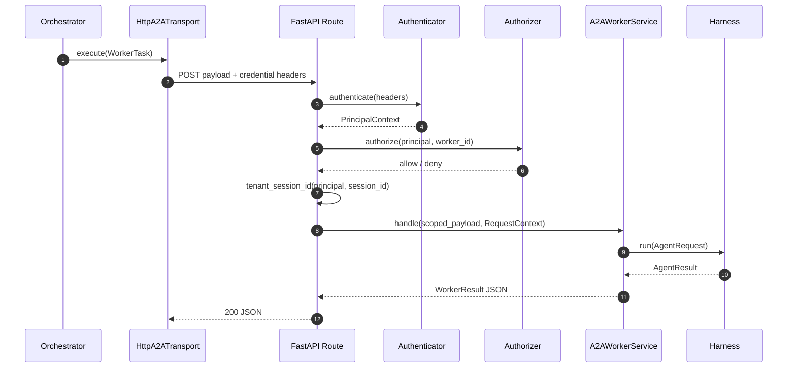

# 部署和认证组件抽象说明

## 1. 这个组件解决什么问题

可以把 `A2AWorkerService` 看成真正执行任务的 Worker，把部署与认证组件看成它的受控入口。入口不关心 Worker 内部使用哪种 Harness 或 Agent 框架；它只负责让每个 HTTP 请求在进入 Worker 前完成同一组安全动作：

1. 验证调用方身份；
2. 判断该身份能否执行目标 Worker；
3. 将业务会话 ID 改写为 tenant 作用域的存储键；
4. 生成不含原始凭据的请求上下文；
5. 将协议、认证和授权错误映射为正确的 HTTP 响应。

这样，IAM 厂商、网关和传输方式可以在部署层替换，而 A2A 协议、Harness 和编排层只面对中立的身份与请求契约。



## 2. 组件分工

| 组件 | 通俗理解 | 负责什么 | 不负责什么 |
|---|---|---|---|
| `HttpA2ATransport` | 远程投递员 | 将 A2A JSON payload 和认证 header 发送到完整 HTTP URL，归一化 JSON 响应 | 验证 token 或决定调用权限 |
| `create_a2a_app()` | Worker 的受控前门 | 注册健康检查和 Worker 路由，组织认证、授权、tenant 隔离与 HTTP 错误映射 | 解析某个 IAM 厂商的 JWT 或执行业务任务 |
| `Authenticator` | 身份翻译员 | 将 header、TLS 身份或网关上下文转换为 `PrincipalContext` | 判断身份能否执行特定 Worker |
| `Authorizer` | 门禁策略 | 根据已认证身份和 `worker_id` 返回允许或拒绝 | 保存原始 token、证书或厂商 claims |
| `A2AWorkerService` | 协议翻译器 | 在 A2A JSON 与 `AgentRequest`/`AgentResult` 之间转换并调用 Harness | 处理 HTTP 认证细节 |
| `tenant_session_id()` | 存储命名空间 | 生成 `tenant_id:session_id`，隔离共享会话 | 改写客户端传输的原始 payload |
| `RequestContext` | 可审计通行证 | 将已验证身份、请求 ID、追踪 ID 交给 Harness | 携带原始凭据 |

关键边界是：部署层负责“这个请求能否进入 Worker”，A2A 服务负责“进入后如何转换协议并调用 Harness”，Harness 负责“如何执行 Agent 并记录会话”。

## 3. 关键数据如何设计

### 3.1 原始凭据与中立身份分开

`PrincipalContext` 是认证成功后的最小身份模型。它只保留业务层真正需要的信息：

| 字段 | 含义 | 安全约束 |
|---|---|---|
| `subject` | 已认证调用方的稳定标识 | 可用于审计，不保存 token |
| `tenant_id` | 调用方所属租户 | 必填，用于构造会话存储键 |
| `roles` | 可选角色集合 | 供自定义授权器使用 |
| `scopes` | 可选权限范围集合 | `ScopeAuthorizer` 使用执行 scope 授权 |
| `auth_mode` | `NONE`、`GATEWAY`、`OIDC` 或 `MTLS` | 记录认证终止方式，便于审计 |

认证实现可以读取 Bearer token、OIDC claims、客户端证书或网关注入 header，但这些原始数据不能写入 `PrincipalContext`、`RequestContext`、`AgentRequest.metadata`、`SharedSession`、prompt 或业务日志。认证层的输出因此可被任何 Harness 和任意 AI 框架消费，不会绑定 IAM SDK。

### 3.2 租户与会话分开

客户端传输的是业务会话 ID，例如 `same-session`；受保护路由在授权通过后调用：

```python
storage_session_id = tenant_session_id(principal, "same-session")
# tenant-a:same-session
```

这个值才会进入 `A2AWorkerService` 与 Harness，继而成为 `SessionProvider` 的存储键。相同的业务会话 ID 在不同 tenant 下不会命中同一份 `SharedSession`。`tenant_id` 为空会被拒绝，空 `session_id` 则视为非法请求。

## 4. 一次受保护调用如何完成

`create_a2a_app()` 为每个 `A2AWorkerService` 绑定公开 path。单次 HTTP 调用的固定链路如下：



错误处理也属于这个固定流程：

- `AuthenticationError` 映射为 `401`，表示凭据缺失、无效或不受信任。
- `AuthorizationError` 映射为 `403`，表示身份已确认但没有目标 Worker 的执行权限。
- 缺少 A2A 必填字段或字段类型不合法映射为 `400`。
- 上述失败不会调用 Worker，也不会返回伪装成正常任务结果的 Agent 输出。

健康检查 `/healthz` 与就绪检查 `/readyz` 不经过 Worker 调用链，分别为负载均衡和编排平台提供实例探针。

## 5. 认证与授权的抽象

接入新的 IAM 或网关时，只需实现两个中立协议：

```python
class MyAuthenticator:
    async def authenticate(self, headers) -> PrincipalContext: ...

class MyAuthorizer:
    async def authorize(self, principal, worker_id) -> bool: ...
```

现有参考实现覆盖三个常用场景：

| 实现 | 场景 | 规则 |
|---|---|---|
| `NoAuthAuthenticator` + `AllowAllAuthorizer` | 显式本地开发 | 固定 local 身份；不得作为生产默认值 |
| `StaticBearerAuthenticator` | 测试或受控开发 | 将预配置 bearer token 映射为 `PrincipalContext` |
| `TrustedGatewayAuthenticator` | 网关已完成认证 | 先验证共享网关凭据，再读取网关注入的身份 header |
| `ScopeAuthorizer` | 最小 scope 策略 | 要求 `a2a:execute` 或 `worker:{worker_id}:execute` |

生产 OIDC 或 mTLS 部署应在 `Authenticator` 内验证 JWT 签名、JWKS、issuer、audience、有效期，或将证书 SAN 映射为中立身份。可信网关模式必须验证网关来源，例如 mTLS client identity 或网关签名；不能直接信任来自公网的 `X-A2A-*` header。

## 6. 如何组装一个受保护 Worker

部署层只接收已经绑定 Harness 的 `A2AWorkerService`，并将认证和授权策略作为依赖注入：

```python
app = create_a2a_app(
    {"/workers/policy/tasks": A2AWorkerService(harness, "policy-worker")},
    authenticator=TrustedGatewayAuthenticator(gateway_secret),
    authorizer=ScopeAuthorizer(),
)
```

客户端通过 `HttpA2ATransport(headers_provider=...)` 在传输层补充短期凭据。凭据属于运行环境或 secret manager；不要放入 `WorkerTask`、use case YAML、会话状态或任务输入。需要 mTLS 时，注入已配置证书、CA 校验和连接池的 `httpx.AsyncClient`，而不是修改 A2A payload。

部署到真实 HTTPS 地址后，编排器只需将 `WorkerDescriptor.endpoint` 配置为完整 URL；`A2AWorkerEndpoint`、`WorkerTask` 和 `WorkerResult` 的接口均不需要改变。

## 7. 边界速记

- HTTP transport 只传递 payload 和 header；认证决策始终发生在 Worker 所在的部署边界。
- `Authenticator` 证明“你是谁”，`Authorizer` 判断“你能否执行这个 Worker”；两者不要混为一个 IAM SDK 调用点。
- `PrincipalContext` 和 `RequestContext` 是跨层中立数据，原始 token、证书和厂商 claims 留在认证适配器内。
- `tenant_session_id()` 在任务进入 Harness 前隔离状态；Harness 无须感知 HTTP 或 IAM 实现。
- A2A 服务负责协议转换，Harness 负责 Agent 生命周期，编排器负责任务选择和顺序；部署认证组件不替代其中任何一层。

更完整的生产运行建议、profile 和验收项见 [部署与认证指南](07_部署与认证指南.md)。